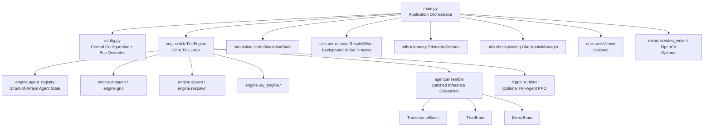
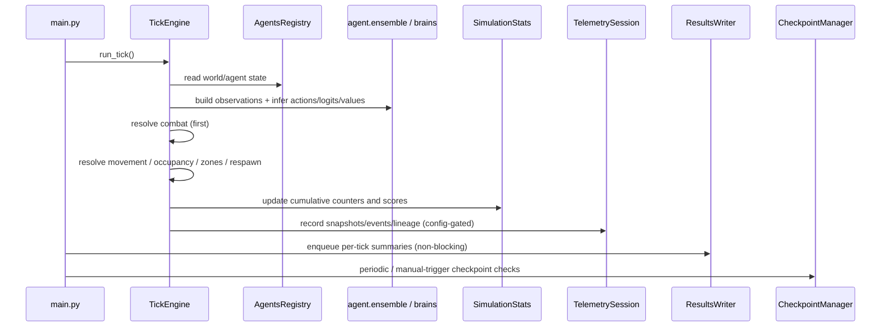

# Infinite War Simulation

A formal, reproducible, and extensible multi-agent grid simulation framework for large-scale reinforcement-learning experiments, telemetry-driven analysis, and long-running headless execution.

This project combines a vectorized simulation engine, per-agent policy models, optional per-agent PPO training, structured telemetry, checkpoint-based recovery, and an optional real-time viewer.

---

## Table of Contents

* [Overview](#overview)
* [System Architecture](#system-architecture)
* [Simulation Tick Lifecycle](#simulation-tick-lifecycle)
* [Core Design Principles](#core-design-principles)
* [Repository Structure](#repository-structure)
* [Policy / Brain Architectures](#policy--brain-architectures)
* [Telemetry, Results, and Analysis Outputs](#telemetry-results-and-analysis-outputs)
* [Checkpointing and Resume](#checkpointing-and-resume)
* [Configuration Model](#configuration-model)
* [Quick Start](#quick-start)
* [Common Runtime Profiles](#common-runtime-profiles)
* [Performance and Operational Notes](#performance-and-operational-notes)
* [Known Constraints and Assumptions](#known-constraints-and-assumptions)
* [Extensibility Guidance](#extensibility-guidance)
* [License](#license)

---

## Overview

**Infinite War Simulation** is a grid-based, multi-agent simulation system designed for:

* high-throughput simulation on CPU/GPU (PyTorch tensor operations),
* reinforcement-learning experimentation (including PPO runtime integration),
* long-duration headless runs with structured telemetry,
* reproducible experiments via checkpointing and deterministic seeding,
* optional UI-based inspection and video capture workflows.

The runtime is organized around a central **tick engine** that advances the simulation by one discrete step (tick), while coordinating agent observations, policy inference, combat/movement rules, statistics, telemetry, and optional training.

---

## System Architecture



### High-level responsibilities

* **`main.py`**: top-level orchestration (startup, run loop, UI/headless mode, telemetry, checkpoints, shutdown).
* **`engine.tick.py`**: core tick execution with combat-first semantics and vectorized state updates.
* **`engine.agent_registry.py`**: dense tensor-based agent storage (GPU-friendly layout).
* **`agent/*`**: policy/value networks and batched inference utilities.
* **`utils/telemetry.py`**: analysis-grade telemetry, lineage, event logs, and atomic file writes.
* **`utils/persistence.py`**: non-blocking background writer process for run outputs.
* **`utils/checkpointing.py`**: crash-safe, resumable checkpoints with RNG-state capture.

---

## Simulation Tick Lifecycle



### Important semantic detail

The engine uses **combat-first** semantics. If an agent is eliminated during combat in the current tick, it does **not** move later in the same tick. This is a deliberate rules choice and materially affects emergent behavior.

---

## Core Design Principles

### 1) Vectorized simulation state

The project is built around tensorized state updates (primarily via PyTorch) to minimize Python-loop overhead and support larger agent populations.

### 2) Dual state consistency (critical invariant)

World state exists in two synchronized forms:

* **Agent registry** (per-agent truth: position, HP, team, alive status, etc.)
* **Grid tensor** (spatial occupancy and fast lookup representation)

Maintaining consistency between these representations is a central correctness requirement.

### 3) Reproducibility and long-run safety

The codebase includes explicit support for:

* deterministic seeding (`FWS_SEED`),
* structured telemetry for post-run analysis,
* atomic checkpoint writes,
* Windows-friendly process handling and graceful shutdown considerations.

### 4) Config-first runtime control

`config.py` is the primary runtime contract. Most operational and experimental parameters are exposed through environment variables (prefixed `FWS_`), enabling reproducible sweeps without source edits.

---

## Repository Structure

```text
Infinite_War_Simulation/
├─ main.py                        # Application orchestrator (headless/UI runtime)
├─ config.py                      # Central config + environment overrides
├─ lineage_tree.py                # Post-run lineage visualization utility
│
├─ agent/
│  ├─ __init__.py
│  ├─ ensemble.py                 # Batched inference dispatcher (loop/vmap fallback)
│  ├─ transformer_brain.py        # Transformer-based actor-critic baseline
│  ├─ tron_brain.py               # Tokenized plan/ray fusion policy architecture
│  ├─ mirror_brain.py             # Two-pass propose→reflect/edit actor-critic
│  └─ obs_spec.py                 # Observation schema split + semantic token mapping
│
├─ engine/
│  ├─ __init__.py
│  ├─ tick.py                     # Core tick engine (combat, movement, zones, RL hooks)
│  ├─ agent_registry.py           # GPU-friendly agent storage (SoA-like layout)
│  ├─ grid.py                     # Grid/world representation utilities
│  ├─ mapgen.py                   # Map and zone generation
│  ├─ spawn.py                    # Agent spawning + brain assignment
│  ├─ respawn.py                  # Respawn controller logic
│  ├─ game/
│  │  └─ move_mask.py             # Movement legality masks / direction logic
│  └─ ray_engine/
│     ├─ raycast_32.py
│     ├─ raycast_64.py
│     └─ raycast_firsthit.py
│
├─ rl/
│  ├─ __init__.py
│  └─ ppo_runtime.py              # Optional per-agent PPO runtime (no parameter sharing)
│
├─ simulation/
│  └─ stats.py                    # Scoring / counters / death logs / reward-friendly deltas
│
├─ ui/
│  ├─ __init__.py
│  ├─ camera.py
│  └─ viewer.py                   # Optional real-time viewer (Pygame)
│
├─ recorder/
│  ├─ __init__.py
│  ├─ recorder.py                 # Arrow/Parquet schema + run metadata helpers
│  ├─ schemas.py
│  └─ video_writer.py             # MP4-first (imageio) with PNG fallback
│
└─ utils/
   ├─ checkpointing.py            # Save/load/resume runtime state
   ├─ persistence.py              # Background writer process (Windows-friendly)
   ├─ profiler.py                 # Runtime profiling helpers
   ├─ sanitize.py                 # Data hygiene / serialization helpers
   └─ telemetry.py                # Agent life, lineage, events, snapshots, validation
```

---

## Policy / Brain Architectures

The codebase includes multiple policy/value model implementations for experimentation.

### `TransformerBrain`

A transformer-style actor-critic network that treats ray features as a token sequence and combines them with a rich-state token for policy/value prediction.

### `TronBrain`

A tokenized architecture using structured observation partitioning (rays + semantic tokens + instinct + learned decision/memory tokens) with self-attention and fusion blocks.

### `MirrorBrain`

A two-pass actor-critic design:

1. **Propose**: generate base logits/value.
2. **Reflect/Edit**: generate a residual correction using an internal reflection token (including uncertainty summaries such as entropy/margin).

This design supports experimentation with self-correction-style policies while preserving a stable baseline path.

### `agent/ensemble.py` (batched inference adapter)

Provides a reliability-first batching layer that:

* supports a safe loop-based path,
* optionally attempts a `torch.func` + `vmap` path for inference acceleration,
* falls back safely when unsupported or incompatible.

---

## Telemetry, Results, and Analysis Outputs

The project distinguishes between **lightweight run outputs** and **richer telemetry outputs**.

### A. Results writer outputs (background process)

The multiprocessing writer is designed to reduce disk I/O impact on the simulation loop.

Typical outputs include:

* `config.json`
* `stats.csv` (per-tick summaries)
* `dead_agents_log.csv` (batched death/kill rows)
* model state metadata sidecar files (`<label>.state_meta.json`, when used)

### B. Telemetry session outputs (analysis-focused)

Telemetry is designed for long runs and offline analysis. It is append-friendly, chunked where appropriate, and uses atomic writes for safety.

Typical telemetry layout:

```text
<run_dir>/telemetry/
├─ agent_life.csv                 # Per-agent lifecycle snapshots (overwrite snapshot style)
├─ lineage_edges.csv              # Parent→child lineage edges (append)
├─ run_meta.json                  # Run metadata (config-gated)
├─ agent_static.csv               # Static per-agent attributes (config-gated)
├─ tick_summary.csv               # Low-frequency summaries (config-gated)
├─ move_summary.csv               # Movement aggregates (if enabled)
├─ counters.csv                   # Extension counters / long-format metrics (if enabled)
└─ events/
   ├─ events_000001.jsonl
   ├─ events_000002.jsonl
   └─ ...
```

### C. Lineage analysis utility

`lineage_tree.py` can build a lineage time-tree visualization from telemetry CSVs and can emit `lineage_time_tree.html` (Plotly path) for large-tree inspection.

---

## Checkpointing and Resume

Checkpointing is designed for long-running experiments and crash recovery.

### Key properties

* atomic writes (temporary file + replace),
* CPU-serializable checkpoint storage for portability,
* saved RNG states (Python / NumPy / PyTorch CPU/CUDA) to improve reproducibility,
* versioned checkpoint format for future evolution.

### Resume behavior

When a checkpoint path is provided via configuration/environment, `main.py` enters **resume mode** and reconstructs world state (including grid/zones and runtime state) before continuing the simulation.

### Manual trigger file

A manual checkpoint can be triggered by creating the configured trigger file in the run directory (default filename: `checkpoint.now`).

---

## Configuration Model

`config.py` functions as a **central configuration contract** with environment-variable overrides.

### Configuration goals

* one-file defaults for reproducibility,
* script-friendly override mechanism (`FWS_*` environment variables),
* stable interface dimensions (observation/action shapes) to preserve checkpoint compatibility,
* profile-based overrides for macro-tuning.

### Common environment variables (examples)

| Category        | Variable                            | Purpose                                                     |
| --------------- | ----------------------------------- | ----------------------------------------------------------- |
| Runtime mode    | `FWS_UI`                            | Enable/disable the real-time viewer (`0` headless / `1` UI) |
| Reproducibility | `FWS_SEED`                          | Deterministic seed for repeatable runs                      |
| Device          | `FWS_CUDA`, `FWS_AMP`               | CUDA enablement and mixed precision behavior                |
| Telemetry       | `FWS_TELEMETRY`                     | Master telemetry toggle                                     |
| Logging cadence | `FWS_HEADLESS_PRINT_EVERY_TICKS`    | Reduce console overhead during long runs                    |
| Checkpointing   | `FWS_CHECKPOINT_PATH`               | Resume from a checkpoint path                               |
| Checkpointing   | `FWS_CHECKPOINT_EVERY_TICKS`        | Periodic checkpoint interval                                |
| UI / recording  | `FWS_RECORD_VIDEO`, `FWS_VIDEO_FPS` | Optional frame/video output                                 |
| RL              | `FWS_PPO_ENABLED`                   | Enable/disable PPO runtime                                  |
| Brain selection | `FWS_BRAIN`                         | Select policy architecture (project-dependent values)       |

> **Note**: The configuration surface is intentionally extensive. For repeatable experimentation, prefer storing run scripts (PowerShell/Bash) alongside results rather than editing defaults in `config.py` for each experiment.

---

## Quick Start

## 1) Requirements

### Core runtime

* Python 3.x
* PyTorch
* NumPy

### Optional components

* `pygame` / `pygame-ce` (UI viewer)
* `opencv-python` (optional video path in `main.py`)
* `imageio` (video writer utility with MP4/PNG fallback behavior)
* `plotly` (lineage HTML visualization utility)
* `pyarrow` (Arrow/Parquet schema workflows in recorder utilities)

> Install only the optional dependencies you plan to use.

## 2) Run the simulation (headless, default config)

### PowerShell (Windows)

```powershell
cd Infinite_War_Simulation
python main.py
```

### Bash (Linux/macOS)

```bash
cd Infinite_War_Simulation
python main.py
```

## 3) Run in headless mode explicitly (recommended for throughput)

### PowerShell

```powershell
$env:FWS_UI = "0"
python main.py
```

### Bash

```bash
export FWS_UI=0
python main.py
```

## 4) Enable telemetry explicitly

### PowerShell

```powershell
$env:FWS_UI = "0"
$env:FWS_TELEMETRY = "1"
python main.py
```

### Bash

```bash
export FWS_UI=0
export FWS_TELEMETRY=1
python main.py
```

## 5) Resume from a checkpoint

### PowerShell

```powershell
$env:FWS_CHECKPOINT_PATH = "C:\path\to\checkpoint.pt"
python main.py
```

### Bash

```bash
export FWS_CHECKPOINT_PATH="/path/to/checkpoint.pt"
python main.py
```

---

## Common Runtime Profiles

### A. High-throughput headless analysis run

Use when the goal is long-duration simulation and post-run telemetry analysis:

* `FWS_UI=0`
* telemetry enabled (`FWS_TELEMETRY=1`)
* lower console print frequency (e.g., larger `FWS_HEADLESS_PRINT_EVERY_TICKS`)
* checkpoint interval configured for recovery safety

### B. Interactive inspection run

Use when debugging visual behavior:

* `FWS_UI=1`
* telemetry optional (can be disabled for faster interactive iteration)
* video recording disabled unless required

### C. RL experimentation run

Use when collecting PPO trajectories/training online:

* `FWS_PPO_ENABLED=1`
* stable observation/action configuration
* telemetry and checkpoints enabled
* deterministic seeding for comparison runs

---

## Performance and Operational Notes

### Throughput-sensitive settings

* Console printing can become a measurable overhead during long runs.
* Telemetry is I/O-bound; chunking and lower-frequency snapshots improve sustained throughput.
* UI rendering and video recording are materially slower than headless mode.

### Windows-specific notes

The codebase includes explicit Windows-oriented handling for:

* multiprocessing writer process behavior,
* Ctrl+C shutdown robustness,
* Intel Fortran runtime console-handler mitigation (to avoid abrupt termination in some numeric-stack environments).

### Reliability-oriented choices in the codebase

* background writer process to prevent logging stalls,
* atomic writes in telemetry/checkpoint paths,
* safe fallbacks in batched inference (`vmap` → loop),
* strict shape/layout checks in observation and model interfaces.

---

## Known Constraints and Assumptions

The current codebase (as organized in this source set) assumes and/or emphasizes the following:

* grid-based world semantics with discrete ticks,
* strict observation layout contracts (shape changes can invalidate checkpoints/models),
* optional components may require additional dependencies,
* per-agent PPO mode uses **no parameter sharing**, which increases compute and memory cost but supports heterogeneous behavior.

If you evolve the observation schema, action space, or checkpoint format, update documentation and migration logic together to preserve reproducibility.

---

## Extensibility Guidance

This project is well-suited to incremental research and systems engineering extensions.

### Typical extension directions

* new brain architectures (maintain `(logits, value)` interface contract),
* new telemetry channels (prefer config-gated, append-friendly outputs),
* alternative reward shaping / scoring terms,
* new map-generation regimes and objective placements,
* offline analytics pipelines consuming `telemetry/events/*.jsonl` and CSV snapshots,
* parameter-sharing or grouped-policy training variants (if desired for scale studies).

### Practical guidance

* Treat `config.py` and `agent/obs_spec.py` as interface contracts.
* Preserve shape assertions and validation paths unless replacing them with stricter checks.
* Prefer additive changes to telemetry and checkpoint schemas where possible.

---

## License

MIT License

Copyright (c) 2026 Ayush Kumar

Permission is hereby granted, free of charge, to any person obtaining a copy...

