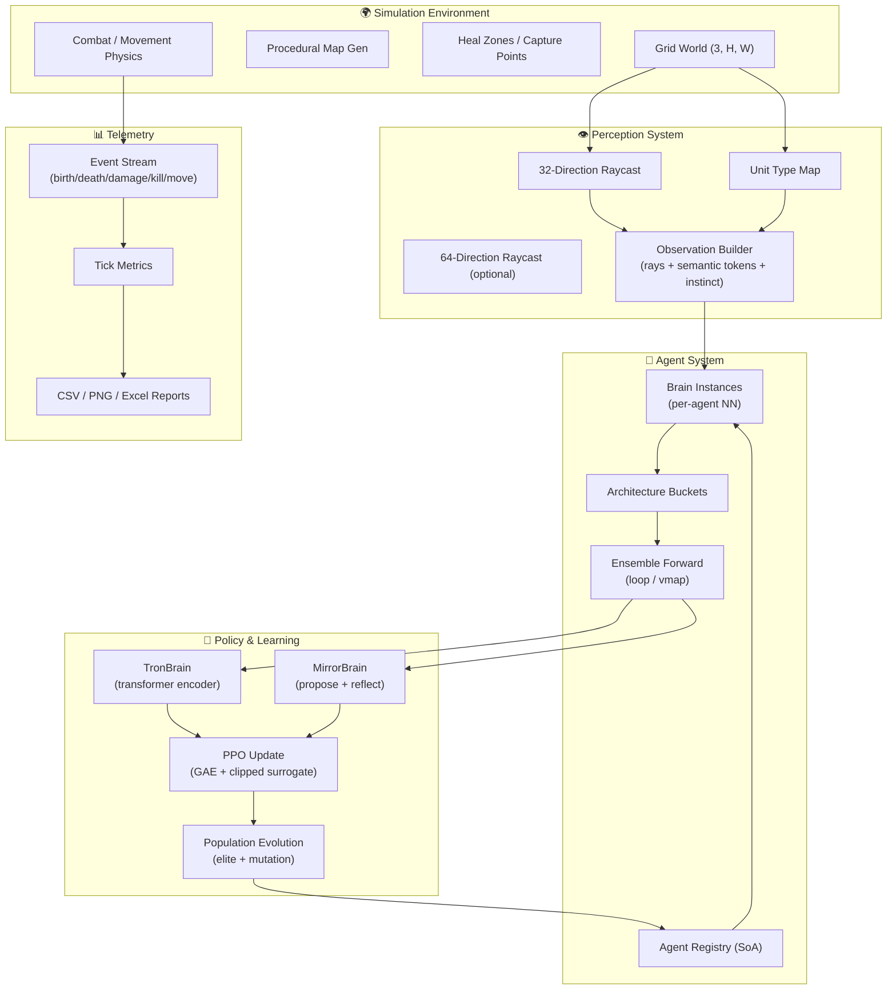
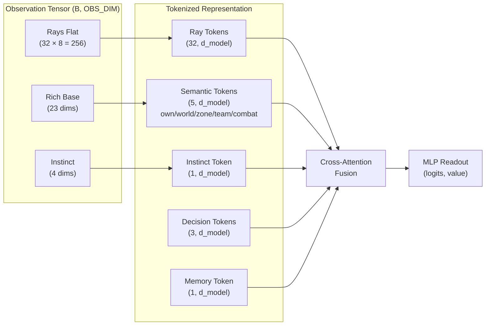
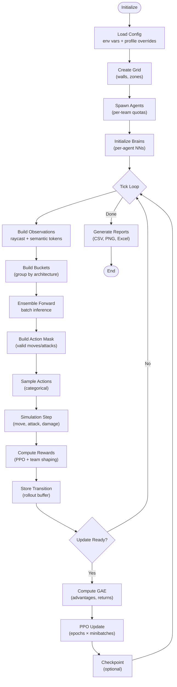

# Neural Siege: Multi-Agent Transformer RL Battle Simulation

> **High-throughput, GPU-accelerated multi-agent reinforcement learning framework featuring transformer-based actor-critic policies, evolutionary population dynamics, and vectorized raycast perception in a grid-based tactical combat environment.**

---

[](https://www.python.org/)
[](https://pytorch.org/)
[](LICENSE)
[](https://developer.nvidia.com/cuda-zone)

```
Status: ACTIVE DEVELOPMENT | Research Prototype | GPU-Optimized
```

---

## Key Highlights

- **Transformer-Based Policies**: Multi-head attention architectures (TronBrain, MirrorBrain) with ray-tokenized observations and semantic feature grouping
- **Vectorized Simulation**: Full GPU acceleration with struct-of-arrays (SoA) agent registry, batched inference, and vmap-based ensemble forward passes
- **Rich Perception**: 32/64-direction raycasting with first-hit classification (6-class one-hot: none, wall, red/blue soldier/archer) + normalized distance and HP
- **Population Evolution**: Per-agent neural networks with elite selection, mutation, and generational tracking (no parameter sharing)
- **PPO Training**: Proximal Policy Optimization with GAE, configurable rollout windows, and rich telemetry
- **Configurable Topology**: Procedural wall generation, heal zones, capture points, and asymmetric unit classes (Soldiers vs Archers)
- **Production Telemetry**: Comprehensive event logging, tick metrics, PPO diagnostics, and automated report generation

---

## Table of Contents

1. [Overview](#overview--problem-statement)
2. [Repository Contents](#what-this-repository-contains)
3. [Architecture](#system--model--project-architecture)
4. [Workflow](#end-to-end-workflow--pipeline)
5. [Repository Structure](#repository-structure)
6. [Installation](#installation)
7. [Quickstart](#quickstart)
8. [Configuration](#configuration)
9. [Data & Observations](#data--inputs--outputs)
10. [Training](#training--build--execution)
11. [Evaluation](#evaluation--validation)
12. [Results](#results--benchmarks)
13. [Design Decisions](#design-decisions--trade-offs)
14. [Limitations](#limitations--known-issues)
15. [Troubleshooting](#troubleshooting)
16. [Reproducibility](#reproducibility--determinism--environment-notes)
17. [Roadmap](#roadmap--next-steps)
18. [Contributing](#contributing-guidelines)
19. [Citation](#citation)
20. [License](#license)

---

## Overview / Problem Statement

**Neural Siege** is a research framework for studying emergent multi-agent behaviors in competitive, partially-observable environments. The system combines:

- **Large-scale multi-agent RL**: Up to 700 concurrent agents with independent neural network policies
- **Structured observation spaces**: Raycast-based perception with semantic tokenization
- **Transformer architectures**: Attention mechanisms for relational reasoning over spatial features
- **Evolutionary dynamics**: Population-based training with inheritance, mutation, and selection

The simulation models tactical combat between two teams (Red vs Blue) with asymmetric unit classes, terrain features, and strategic objectives. Agents must learn coordination, positioning, and combat tactics through decentralized PPO training.

### Core Research Questions

- How do transformer-based policies compare to MLP baselines in spatially structured environments?
- What emergent behaviors arise from per-agent evolution vs. shared policy parameters?
- How does observation tokenization affect sample efficiency and generalization?

---

## What This Repository Contains

| Component | Description |
|-----------|-------------|
| `agent/` | Neural network architectures: TronBrain, MirrorBrain, TransformerBrain, ensemble inference |
| `engine/` | Simulation core: grid world, agent registry, raycasting, map generation, action masking |
| `config.py` | Comprehensive configuration system with environment variable overrides and profile presets |
| `ppo/` | Proximal Policy Optimization implementation (assumed from config references) |
| `telemetry/` | Event logging, metrics aggregation, and report generation |
| `viewer/` | Optional PyGame-based visualization (headless mode supported) |

### Brain Architectures

| Brain | Description | Key Features |
|-------|-------------|--------------|
| **TronBrain** | Single-pass transformer encoder | Ray self-attention → semantic self-attention → cross-attention fusion → decision token readout |
| **MirrorBrain** | Two-pass propose-reflect architecture | PASS 1: Propose logits/value; PASS 2: Reflection token with entropy/margin → residual correction |
| **TransformerBrain** | Simplified baseline | Cross-attention (rays→rich) → self-attention → mean pool → MLP |

---

## System / Model / Project Architecture



### Observation Architecture



---

## End-to-End Workflow / Pipeline



---

## Repository Structure

```
Infinite_War_Simulation/
├── agent/                          # Neural network architectures
│   ├── __init__.py                 # Exports: TransformerBrain, TronBrain, MirrorBrain
│   ├── ensemble.py                 # Batched inference: loop + vmap paths
│   ├── mirror_brain.py             # Two-pass propose-reflect transformer
│   ├── obs_spec.py                 # Observation splitting & semantic token building
│   ├── transformer_brain.py        # Baseline transformer policy
│   └── tron_brain.py               # Tron v1 transformer encoder
│
├── engine/                         # Simulation core
│   ├── __init__.py                 # Exports: make_grid, AgentsRegistry
│   ├── agent_registry.py           # SoA agent storage with bucketing
│   ├── grid.py                     # Grid initialization & device asserts
│   ├── mapgen.py                   # Procedural walls, heal zones, capture points
│   ├── game/
│   │   └── move_mask.py            # Action validity masking (17/41 actions)
│   └── ray_engine/
│       ├── raycast_32.py           # 32-direction vectorized raycasting
│       ├── raycast_64.py           # 64-direction vectorized raycasting
│       └── raycast_firsthit.py     # 8-direction raycasting + unit map builder
│
├── config.py                       # Central configuration with env var parsing
├── dump_py_to_text.py              # Utility: aggregate source files
└── README.md                       # This document
```

---

## Installation

### Prerequisites

- Python 3.10+
- PyTorch 2.0+ (with CUDA optional but recommended)
- NumPy
- (Optional) PyGame for visualization
- (Optional) pandas, matplotlib, openpyxl for telemetry reports

### Setup

```bash
# Clone repository
git clone <repository-url>
cd Infinite_War_Simulation

# Create virtual environment
python -m venv venv
source venv/bin/activate  # Windows: venv\Scripts\activate

# Install dependencies
pip install torch numpy

# Optional: visualization and telemetry
pip install pygame pandas matplotlib openpyxl

# Verify installation
python -c "import config; print(config.summary_str())"
```

### Environment Variables

Key environment variables for configuration:

```bash
export FWS_CUDA=1                    # Enable CUDA if available
export FWS_AMP=1                     # Enable automatic mixed precision
export FWS_UI=0                      # Headless mode (recommended for training)
export FWS_PROFILE=train_fast        # Profile preset: debug/train_fast/train_quality
export FWS_SEED=42                   # RNG seed
export FWS_RESULTS_DIR=./results     # Output directory
```

---

## Quickstart

### Headless Training Run

```bash
# Fast training profile (headless, optimized)
FWS_PROFILE=train_fast FWS_UI=0 python -m main

# Quality profile (larger model, slower)
FWS_PROFILE=train_quality FWS_UI=0 FWS_TELEM_EXCEL=1 python -m main

# Debug profile (small map, UI enabled)
FWS_PROFILE=debug FWS_UI=1 python -m main
```

### Programmatic Usage

```python
import torch
import config
from engine import make_grid, AgentsRegistry
from agent import TronBrain

# Initialize grid
grid = make_grid(device=config.DEVICE)

# Create agent registry
registry = AgentsRegistry(grid)

# Initialize brain (example)
brain = TronBrain(obs_dim=config.OBS_DIM, act_dim=config.NUM_ACTIONS)

# Forward pass
obs = torch.randn(1, config.OBS_DIM, device=config.DEVICE)
logits, value = brain(obs)
print(f"Logits: {logits.shape}, Value: {value.shape}")
```

---

## Configuration

### Profile Presets

| Profile | Use Case | Key Settings |
|---------|----------|--------------|
| `default` | Balanced baseline | 100×100 grid, 300 agents/team, d_model=64 |
| `debug` | Development & visualization | 80×80 grid, 30 agents/team, UI enabled |
| `train_fast` | Throughput optimization | Headless, vmap enabled, reduced depth |
| `train_quality` | Capacity & performance | Headless, d_model=192, deeper layers |

### Core Configuration Parameters

| Category | Parameter | Default | Description |
|----------|-----------|---------|-------------|
| **World** | `GRID_WIDTH/HEIGHT` | 100×100 | Map dimensions |
| | `MAX_AGENTS` | 700 | Global agent capacity |
| | `START_AGENTS_PER_TEAM` | 300 | Initial population |
| **Observation** | `RAY_TOKEN_COUNT` | 32 | Number of ray directions |
| | `RAY_FEAT_DIM` | 8 | Features per ray (6 one-hot + dist + HP) |
| | `RICH_BASE_DIM` | 23 | Non-ray feature dimensions |
| | `OBS_DIM` | 283 | Total observation (256 + 23 + 4) |
| **TronBrain** | `TRON_D_MODEL` | 64 | Embedding dimension |
| | `TRON_HEADS` | 4 | Attention heads |
| | `TRON_RAY_LAYERS` | 4 | Ray encoder depth |
| | `TRON_SEM_LAYERS` | 2 | Semantic encoder depth |
| | `TRON_FUSION_LAYERS` | 2 | Cross-attention fusion depth |
| **PPO** | `PPO_WINDOW_TICKS` | 512 | Rollout horizon |
| | `PPO_LR` | 3e-4 | Learning rate |
| | `PPO_CLIP` | 0.2 | Surrogate clipping |
| | `PPO_ENTROPY_COEF` | 0.05 | Entropy bonus |
| | `PPO_GAMMA` | 0.995 | Discount factor |
| | `PPO_LAMBDA` | 0.95 | GAE lambda |

### Full Configuration Example

```python
# config.py excerpt - all parameters are env-overridable
TRON_D_MODEL = _env_int("FWS_TRON_DMODEL", 64)
TRON_HEADS = _env_int("FWS_TRON_HEADS", 4)
TRON_RAY_LAYERS = _env_int("FWS_TRON_RAY_LAYERS", 4)
TRON_SEM_LAYERS = _env_int("FWS_TRON_SEM_LAYERS", 2)
TRON_FUSION_LAYERS = _env_int("FWS_TRON_FUSION_LAYERS", 2)
TRON_MLP_HIDDEN = _env_int("FWS_TRON_MLP_HID", 256)

# Mirror inherits from Tron by default
MIRROR_D_MODEL = _env_int("FWS_MIRROR_DMODEL", int(TRON_D_MODEL))
# ... etc
```

---

## Data / Inputs / Outputs

### Observation Space

| Component | Shape | Description |
|-----------|-------|-------------|
| `rays_flat` | `(B, 256)` | 32 rays × 8 features (one-hot type + dist + HP) |
| `rich_base` | `(B, 23)` | Structured context features |
| `instinct` | `(B, 4)` | Compact context vector |
| **Total** | `(B, 283)` | Flattened observation vector |

### Ray Feature Encoding (per ray)

| Index | Feature | Description |
|-------|---------|-------------|
| 0-5 | `onehot6` | Hit type: none, wall, red-soldier, red-archer, blue-soldier, blue-archer |
| 6 | `dist_norm` | Normalized distance to first hit |
| 7 | `hp_norm` | HP at hit location (0 if no agent) |

### Action Space

| Layout | Actions | Description |
|--------|---------|-------------|
| 17-action | 0-16 | idle + 8 moves + 8 melee attacks |
| 41-action | 0-40 | idle + 8 moves + 8 directions × 4 ranges |

Unit gating:
- Soldiers: range 1 only
- Archers: ranges 1-4 (configurable via `ARCHER_RANGE`)

### Telemetry Outputs

| File | Content |
|------|---------|
| `telemetry/events.jsonl` | Birth, death, damage, kill, move events |
| `telemetry/tick_metrics.csv` | Per-tick aggregates |
| `telemetry/ppo_training_telemetry.csv` | Losses, KL, entropy, gradients |
| `telemetry/summary.csv` | Live run summary |
| `reports/` | PNG plots, Excel exports (optional) |

---

## Training / Build / Execution

### PPO Training Loop

```python
# Pseudo-code illustrating the training loop
for tick in range(max_ticks):
    # 1. Collect rollouts
    for step in range(PPO_WINDOW_TICKS):
        obs = build_observations(alive_agents)
        logits, values = ensemble_forward(brains, obs)
        actions = sample_actions(logits, action_masks)
        rewards, dones = step_simulation(actions)
        store_transition(obs, actions, rewards, values, dones)

    # 2. Compute GAE
    advantages, returns = compute_gae(rewards, values, dones)

    # 3. PPO update
    for epoch in range(PPO_EPOCHS):
        for minibatch in split_minibatches(advantages, returns):
            new_logits, new_values = forward(minibatch.obs)
            policy_loss = clipped_surrogate_loss(...)
            value_loss = mse_loss(new_values, minibatch.returns)
            entropy_bonus = entropy(new_logits)
            loss = policy_loss + value_coef * value_loss - entropy_coef * entropy_bonus
            optimizer.step(loss)

    # 4. Population evolution (optional)
    apply_respawn_and_mutation(dead_agents, elite_selection=True)
```

### Execution Modes

| Mode | Command | Use Case |
|------|---------|----------|
| Headless training | `FWS_UI=0 python main.py` | Maximum throughput |
| Visual inspection | `FWS_UI=1 python main.py` | Behavior observation |
| Checkpoint resume | `FWS_CHECKPOINT_PATH=ckpt.pt python main.py` | Continue training |

---

## Evaluation / Validation

### Metrics Tracked

| Category | Metric | Description |
|----------|--------|-------------|
| **Population** | `alive_red/blue` | Living agents per team |
| | `deaths_per_tick` | Mortality rate |
| | `avg_generation` | Evolutionary progress |
| **Combat** | `kills_per_tick` | Kill rate |
| | `damage_dealt/taken` | Combat intensity |
| **Objectives** | `cp_control_red/blue` | Capture point ownership |
| | `heal_zone_utilization` | Sustainability metric |
| **PPO** | `policy_loss` | Surrogate loss |
| | `value_loss` | Critic MSE |
| | `approx_kl` | Policy drift |
| | `entropy` | Exploration level |

### Validation Checklist

- [ ] Observation shape invariants hold: `(B, 283)`
- [ ] Logits shape matches action dim: `(B, NUM_ACTIONS)`
- [ ] Value shape: `(B, 1)`
- [ ] No NaN/Inf in gradients (clip norm enforced)
- [ ] KL divergence below target (`PPO_TARGET_KL`)
- [ ] Checkpoint files loadable and resume correctly

---

## Results / Benchmarks

> **TODO**: Add benchmark numbers from actual training runs

### Performance Baselines

| Configuration | Agents | TPS (CPU) | TPS (CUDA) | Notes |
|--------------|--------|-----------|------------|-------|
| debug | 60 | ~500 | ~2000 | Small grid, UI off |
| train_fast | 600 | ~50 | ~500 | Headless, vmap |
| train_quality | 600 | ~10 | ~200 | Larger model |

### Training Curves

> **TODO**: Add example learning curves (episode return vs. ticks)

### Ablation Studies

> **TODO**: Add ablation results

| Variant | Description | Expected Impact |
|---------|-------------|-----------------|
| No attention | Replace transformer with MLP | Reduced spatial reasoning |
| Shared params | Single policy for all agents | Faster convergence, less diversity |
| No reflection | Use TronBrain only (no Mirror) | Simpler, potentially less adaptive |
| Fixed mutation | Constant noise vs. adaptive | Exploration vs. exploitation tradeoff |

---

## Design Decisions / Trade-offs

### 1. Per-Agent vs. Shared Parameters

**Decision**: Per-agent brains (`PER_AGENT_BRAINS=True`)

- **Pros**: Population diversity, evolutionary dynamics, heterogeneous strategies
- **Cons**: Higher memory, slower inference, no gradient sharing
- **Mitigation**: Bucketing + vmap for batched inference

### 2. Ray Tokenization

**Decision**: Treat rays as sequence tokens for self-attention

- **Pros**: Relational reasoning between directions, learnable positional embeddings
- **Cons**: Quadratic attention cost in ray count
- **Mitigation**: Fixed 32 rays, efficient attention implementation

### 3. SoA vs. AoS Agent Storage

**Decision**: Struct-of-Arrays in dense tensors

- **Pros**: GPU-friendly, vectorized operations, cache efficiency
- **Cons**: Less ergonomic than Python objects
- **Mitigation**: Registry abstraction with helper methods

### 4. Two-Pass (MirrorBrain) Design

**Decision**: Proposal + reflection with residual correction

- **Pros**: Explicit uncertainty modeling, initialized near base policy
- **Cons**: 2× forward pass cost
- **Mitigation**: Optional (can use TronBrain only)

---

## Limitations / Known Issues

| Issue | Severity | Workaround |
|-------|----------|------------|
| vmap compatibility | Medium | Falls back to Python loop for TorchScript modules |
| Float16 UID precision | Low | Separate int64 `agent_uids` tensor |
| Raycast discretization | Low | Continuous directions cast to integer indices |
| Memory at scale | Medium | Reduce `MAX_AGENTS` or use CPU offloading |
| Checkpoint size | Medium | Keep only latest N checkpoints (`CHECKPOINT_KEEP_LAST_N`) |

### Assumptions

- Grid dimensions fit in GPU memory (3 × H × W × 4 bytes)
- Agent count ≤ 700 (configurable but tested at this scale)
- PyTorch 2.0+ for `torch.func` vmap support
- Observation layout fixed at import time

---

## Troubleshooting

### Common Issues

**Issue**: `RuntimeError: Device mismatch`
```python
# Solution: Ensure grid and registry on same device
grid = make_grid(device=config.DEVICE)
registry = AgentsRegistry(grid)  # Inherits device from grid
```

**Issue**: `RuntimeError: OBS layout mismatch`
```python
# Solution: Verify config consistency
assert config.OBS_DIM == config.RAYS_FLAT_DIM + config.RICH_TOTAL_DIM
```

**Issue**: Slow training TPS
```bash
# Solutions:
FWS_UI=0                    # Disable UI
FWS_USE_VMAP=1              # Enable vectorized inference
FWS_AMP=1                   # Enable mixed precision
FWS_PROFILE=train_fast      # Use optimized profile
```

**Issue**: OOM on GPU
```bash
# Solutions:
FWS_MAX_AGENTS=400          # Reduce population
FWS_TRON_DMODEL=32          # Smaller model
FWS_CUDA=0                  # Fall back to CPU
```

### Debug Mode

```bash
# Maximum verbosity
FWS_PROFILE=debug FWS_VMAP_DEBUG=1 FWS_TELEM_VALIDATE=2 python main.py
```

---

## Reproducibility / Determinism / Environment Notes

### Seeds

```python
# Set all relevant seeds
import torch
import numpy as np
import random
import config

torch.manual_seed(config.RNG_SEED)
np.random.seed(config.RNG_SEED)
random.seed(config.RNG_SEED)

# CUDA determinism (may impact performance)
torch.backends.cudnn.deterministic = True
torch.backends.cudnn.benchmark = False
```

### Checkpointing for Reproducibility

```bash
# Save checkpoint every N ticks
export FWS_CHECKPOINT_EVERY_TICKS=50000

# Resume from checkpoint
export FWS_CHECKPOINT_PATH=results/run_001/checkpoint_100000.pt
export FWS_RESUME_OUTPUT_CONTINUITY=1  # Continue same run folder
```

### Environment Capture

```python
# Dump full config state
from config import dump_config_dict
import json

with open('run_config.json', 'w') as f:
    json.dump(dump_config_dict(), f, indent=2)
```

---

## Roadmap / Next Steps

### Near-term (Active)

- [ ] Integrate PPO training loop (currently referenced but not in dump)
- [ ] Add comprehensive benchmark suite
- [ ] Implement curriculum learning for map complexity
- [ ] Add unit tests for raycasting invariants

### Medium-term

- [ ] Multi-GPU support (DDP for population parallelism)
- [ ] Transformer compression (quantization, pruning)
- [ ] Hierarchical policies (squad-level coordination)
- [ ] Real-time visualization improvements

### Research Directions

- [ ] Communication protocols between agents
- [ ] Meta-learning for fast adaptation
- [ ] Adversarial robustness of policies
- [ ] Transfer learning across map topologies

---

## Contributing Guidelines

### Code Style

- Type hints required for public functions
- Docstrings follow Google style
- Use `from __future__ import annotations` for forward references
- Prefer tensor operations over Python loops

### Testing

```bash
# Run validation (when test suite exists)
python -m pytest tests/

# Quick smoke test
python -c "import config; from agent import TronBrain; b = TronBrain(283, 41); print('OK')"
```

### Pull Request Process

1. Fork and branch from `main`
2. Add tests for new functionality
3. Ensure no regression in `debug` profile
4. Update documentation
5. Submit PR with description of changes and motivation

---

## Citation

If you use this codebase in your research, please cite:

```bibtex
@software{neural_siege_2024,
  title = {Neural Siege: Multi-Agent Transformer RL Battle Simulation},
  author = {TODO: Add authors},
  year = {2024},
  url = {TODO: Add repository URL},
  note = {Research prototype for multi-agent reinforcement learning}
}
```

---

## License

MIT License - See [LICENSE](LICENSE) for details.

---

## Acknowledgements

- PyTorch team for the excellent ML framework
- OpenAI for PPO and GAE foundations
- The multi-agent RL research community for inspiration and baselines

---

<p align="center">
  <em>Built for research. Optimized for throughput. Designed for emergence.</em>
</p>
