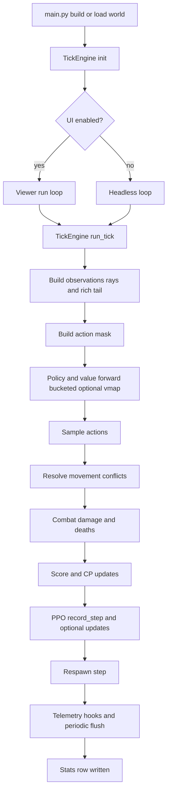

# Infinite War Simulation

A tick-based, grid-world, two-team multi-agent simulation with per-agent neural policies and optional training/telemetry (see `Infinite_War_Simulation/main.py`).

> **Status:** Research code. Several behaviors depend on config flags and environment variables (see `Infinite_War_Simulation/config.py`).

---

## What this is (5 bullets)

* **Discrete-time grid simulation**: the world advances in integer ticks; the engine owns the tick loop and mechanics (see `Infinite_War_Simulation/engine/tick.py`).
* **Many independent agents**: each agent has its own row in a registry tensor + a unique `agent_id` (see `Infinite_War_Simulation/engine/agent_registry.py`).
* **Two teams**: occupancy encodes walls and team cells; rendering shows team stats (see `Infinite_War_Simulation/engine/ray_engine/raycast_32.py`, `Infinite_War_Simulation/ui/viewer.py`).
* **Neural “brains” per agent**: multiple architectures exist (TransformerBrain / TronBrain / MirrorBrain) and are run in buckets (optionally via `torch.func.vmap`) (see `Infinite_War_Simulation/agent/*.py`, `Infinite_War_Simulation/agent/ensemble.py`).
* **Optional logging & telemetry**: results CSVs + run summary; optional scientific telemetry sidecars (agent life table, lineage edges, event jsonl, tick summaries) (see `Infinite_War_Simulation/utils/results_writer.py`, `Infinite_War_Simulation/utils/telemetry.py`).

---

## Quickstart

### Requirements

* Python: **Unknown (not found in code dump)**
* Core runtime deps (imported):

  * `torch` (see `Infinite_War_Simulation/main.py`, `Infinite_War_Simulation/engine/tick.py`)
  * `numpy` (see `Infinite_War_Simulation/main.py`)
  * `pygame` / `pygame-ce` (UI) (see `Infinite_War_Simulation/ui/viewer.py`)
* Optional:

  * `opencv-python` for raw AVI recording (`cv2`) (see `_SimpleRecorder` in `Infinite_War_Simulation/main.py`)

### Install

If you do not have a requirements file, install the minimal set:

```bash
pip install torch numpy pygame-ce
# optional
pip install opencv-python
```

### Run

From the folder that contains `Infinite_War_Simulation/`:

```bash
cd Infinite_War_Simulation
python main.py
```

Headless (no UI) is controlled by config/env flags (see `Infinite_War_Simulation/config.py`, and the UI/headless switch in `Infinite_War_Simulation/main.py`).

### Outputs

A run creates a timestamped directory under `results/` (see `Infinite_War_Simulation/utils/results_writer.py`). Typical artifacts:

* `results/sim_YYYY-MM-DD_HH-MM-SS/config.json` (config snapshot) (see `Infinite_War_Simulation/utils/results_writer.py`)
* `results/sim_.../stats.csv` (per-tick rows) (see `Infinite_War_Simulation/utils/results_writer.py`, `Infinite_War_Simulation/simulation/stats.py`)
* `results/sim_.../dead_agents_log.csv` (death rows) (see `Infinite_War_Simulation/utils/results_writer.py`, `Infinite_War_Simulation/simulation/stats.py`)
* `results/sim_.../summary.json` (final status + duration + final scores) (see `Infinite_War_Simulation/main.py`)
* `results/sim_.../crash_trace.txt` (only on crash) (see `Infinite_War_Simulation/main.py`)
* `results/sim_.../simulation_raw.avi` (only if `RECORD_VIDEO` is enabled and `cv2` is installed) (see `_SimpleRecorder` in `Infinite_War_Simulation/main.py`)
* `results/sim_.../telemetry/…` (only if telemetry enabled) (see `Infinite_War_Simulation/utils/telemetry.py`)

---

## Core concepts (skim table)

| Concept            | Meaning (short)                                                         | Where in code                                                                                                                                        |
| ------------------ | ----------------------------------------------------------------------- | ---------------------------------------------------------------------------------------------------------------------------------------------------- |
| Tick engine        | Owns the tick loop and applies all mechanics per tick                   | `Infinite_War_Simulation/engine/tick.py`                                                                                                             |
| Grid tensor        | World state tensor; channel 0 is occupancy used by renderer/recorder    | `Infinite_War_Simulation/engine/grid.py`, `_SimpleRecorder` in `Infinite_War_Simulation/main.py`                                                     |
| Agent registry     | Per-agent data stored in a tensor (hp, team, pos, etc.)                 | `Infinite_War_Simulation/engine/agent_registry.py`                                                                                                   |
| Rays / perception  | Fast 32-ray first-hit raycast used to build observations                | `Infinite_War_Simulation/engine/ray_engine/raycast_32.py`                                                                                            |
| Observation layout | Flat vector split into rays + rich_base + instinct; strict shape checks | `Infinite_War_Simulation/agent/obs_spec.py`, `Infinite_War_Simulation/config.py`                                                                     |
| Action mask        | Valid action masking before sampling                                    | `Infinite_War_Simulation/engine/game/move_mask.py`                                                                                                   |
| Brains             | Neural policies/values (TransformerBrain, TronBrain, MirrorBrain)       | `Infinite_War_Simulation/agent/transformer_brain.py`, `Infinite_War_Simulation/agent/tron_brain.py`, `Infinite_War_Simulation/agent/mirror_brain.py` |
| Bucketed forward   | Groups agents by brain type; optional `torch.func.vmap` inference       | `Infinite_War_Simulation/agent/ensemble.py`, `Infinite_War_Simulation/engine/tick.py`                                                                |
| PPO runtime        | Per-agent PPO buffers + update logic (if enabled)                       | `Infinite_War_Simulation/rl/ppo_runtime.py`                                                                                                          |
| Stats              | Aggregates scores/kills/deaths/alive; provides CSV rows                 | `Infinite_War_Simulation/simulation/stats.py`                                                                                                        |
| Checkpoints        | Save/load full world + runtime state                                    | `Infinite_War_Simulation/utils/checkpointing.py`, `Infinite_War_Simulation/main.py`                                                                  |
| Results writer     | Background process writes CSVs + config.json                            | `Infinite_War_Simulation/utils/results_writer.py`                                                                                                    |
| Telemetry          | Optional research-grade event logs + lineage tables                     | `Infinite_War_Simulation/utils/telemetry.py`                                                                                                         |
| UI viewer          | Pygame loop + HUD (tick, speed, team stats)                             | `Infinite_War_Simulation/ui/viewer.py`                                                                                                               |

---

## Architecture

### Runtime pipeline (Mermaid)



> Note: each labeled stage above corresponds to explicit blocks and helpers inside `TickEngine.run_tick` and its collaborators (see `Infinite_War_Simulation/engine/tick.py`).

### Module layout (ASCII)

```
Infinite_War_Simulation/
  main.py                 # entrypoint + run loops + results/telemetry setup
  config.py               # env-driven configuration knobs
  engine/                 # grid, registry, tick loop, raycast, spawn, mapgen
  agent/                  # brain implementations + observation spec + inference bucketing
  rl/                     # PPO runtime (per-agent)
  simulation/             # stats + team score bookkeeping
  ui/                     # pygame renderer/viewer
  utils/                  # checkpointing, telemetry, background writers, profiling
```

---

## Determinism & reproducibility

* **Torch + NumPy seeding**: if `FWS_SEED` is set, the program seeds `torch` (CPU + CUDA) and `numpy` (see `_seed_all_from_env` in `Infinite_War_Simulation/main.py`).
* **Other RNG sources**: the map/spawn code uses Python’s `random` module (see `Infinite_War_Simulation/engine/mapgen.py`, `Infinite_War_Simulation/engine/spawn.py`). Seeding for `random` is **Unknown (not found in main loop)**.
* **Reproduce a run (best effort)**:

  1. Set `FWS_SEED` to a fixed integer.
  2. Keep the same device (`TORCH_DEVICE`) and config knobs.
  3. Prefer headless mode for fewer timing effects.

<details>
<summary>Useful env/config knobs (selected)</summary>

| Knob                                   | What it changes                                           | Where                                                                            |
| -------------------------------------- | --------------------------------------------------------- | -------------------------------------------------------------------------------- |
| `FWS_SEED`                             | Seeds `torch` + `numpy` in `main.py`                      | `Infinite_War_Simulation/main.py`                                                |
| `FWS_TORCH_DEVICE`                     | Selects device string (`cuda` / `cpu`)                    | `Infinite_War_Simulation/config.py`                                              |
| `FWS_START_AGENTS_PER_TEAM`            | Initial agents per team                                   | `Infinite_War_Simulation/config.py`, spawn in `Infinite_War_Simulation/main.py`  |
| `FWS_SPAWN_MODE`                       | `uniform` vs `symmetric` spawning                         | `Infinite_War_Simulation/main.py`                                                |
| `FWS_TICK_LIMIT`                       | Stop after N ticks (0 = infinite)                         | `Infinite_War_Simulation/config.py`, loop in `Infinite_War_Simulation/main.py`   |
| `FWS_TARGET_FPS`                       | UI frame cap                                              | `Infinite_War_Simulation/config.py`, `Infinite_War_Simulation/ui/viewer.py`      |
| `FWS_USE_VMAP` / `FWS_VMAP_MIN_BUCKET` | Enable/threshold `torch.func.vmap` inference              | `Infinite_War_Simulation/config.py`, `Infinite_War_Simulation/agent/ensemble.py` |
| `FWS_AMP`                              | AMP autocast for brains (if implemented in tick/PPO path) | `Infinite_War_Simulation/config.py`, `Infinite_War_Simulation/engine/tick.py`    |
| `FWS_CHECKPOINT_PATH`                  | Resume from checkpoint file                               | `Infinite_War_Simulation/config.py`, `Infinite_War_Simulation/main.py`           |

</details>

---

## Telemetry / logs

Telemetry is implemented as an additive, file-based sidecar inside the run folder (see `Infinite_War_Simulation/utils/telemetry.py`).

* Toggle: `TELEMETRY_ENABLED` is read from config (see `Infinite_War_Simulation/utils/telemetry.py`, `Infinite_War_Simulation/config.py`).
* Output layout (inside `results/sim_.../telemetry/`):

  * `agent_life.csv` (snapshot table)
  * `lineage_edges.csv` (append-only parent→child edges)
  * `tick_summary.csv` (per-tick aggregates)
  * `agent_static.csv` + `run_meta.json` (optional sidecars)
  * `events/events_00001.jsonl` (chunked append-only event log)

<details>
<summary>CSV schemas (as written in code)</summary>

**`tick_summary.csv`** (see `Infinite_War_Simulation/utils/telemetry.py`):

* `tick`, `red_alive`, `blue_alive`, `red_mean_hp`, `blue_mean_hp`, `red_kills`, `blue_kills`, `red_deaths`, `blue_deaths`, `red_dmg_dealt`, `blue_dmg_dealt`

**`lineage_edges.csv`** (see `Infinite_War_Simulation/utils/telemetry.py`):

* `tick`, `parent_id`, `child_id`

**`agent_life.csv`** (see `Infinite_War_Simulation/utils/telemetry.py`):

* `agent_id`, `slot_id`, `team`, `unit_type`, `born_tick`, `death_tick`, `parent_id`, `kills_total`, `damage_dealt_total`, `damage_taken_total`, `offspring_count`, `notes`

</details>

<details>
<summary>Lineage visualization helper</summary>

A standalone script exists to build a filtered lineage tree graph:

* `lineage_tree.py` expects `lineage_edges.csv` and (optionally) `agent_life.csv` in the current working directory (see `lineage_tree.py`).
* It can use Plotly if enabled in the script (`USE_PLOTLY = True`) (see `lineage_tree.py`).

</details>

---

## Screenshot


Caption (what is visible):

* A square grid world with many colored cells and several larger shaded green regions.
* HUD shows: `Tick 12270 [ 0.25x ]` and two team lines (`Red … Alive:…`, `Blue … Alive:…`).
* Team lines include fields like `S`, `CP`, `K`, `D`, and a split like `(S:…, A:…)` (see HUD formatting in `Infinite_War_Simulation/ui/viewer.py`).

---

## Minimal repo structure (from the code dump)

```text
Infinite_War_Simulation/
  main.py
  config.py
  agent/
    ensemble.py
    transformer_brain.py
    tron_brain.py
    mirror_brain.py
    obs_spec.py
  engine/
    tick.py
    agent_registry.py
    grid.py
    mapgen.py
    spawn.py
    respawn.py
    ray_engine/raycast_32.py
    game/move_mask.py
  rl/ppo_runtime.py
  simulation/stats.py
  ui/viewer.py
  utils/
    results_writer.py
    telemetry.py
    checkpointing.py
    profiler.py
    sanitize.py
```

---

## Roadmap (safe)

* Document full environment-variable surface area (many knobs live in `Infinite_War_Simulation/config.py`).
* Add a small “analysis/” notebook or scripts that parse `telemetry/events/*.jsonl` (event schema already versioned) (see `Infinite_War_Simulation/utils/telemetry.py`).
* Optional gzip for event logs is flagged but not implemented (see `events_gzip` note in `Infinite_War_Simulation/utils/telemetry.py`).
* Make seeding cover Python `random` for full map/spawn determinism (map/spawn use `random`; see `Infinite_War_Simulation/engine/mapgen.py`, `Infinite_War_Simulation/engine/spawn.py`).
* Add a minimal `requirements.txt` / `pyproject.toml` (Unknown: not present in the code dump).
