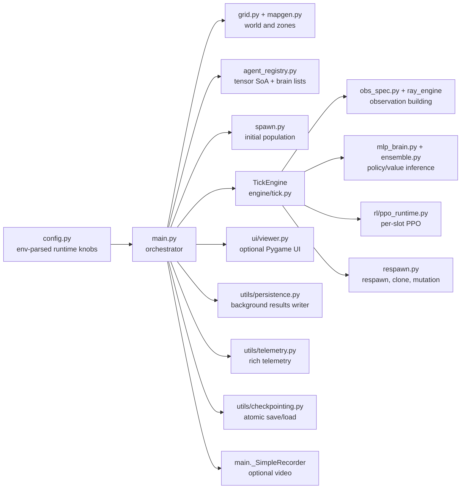
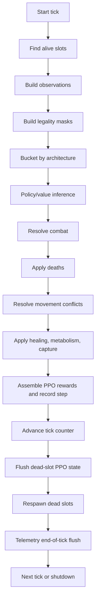

# Neural-Abyss: Technical Paper, System Theory, Design Decisions, and Code-Level Analysis

## Subtitle
A repository-grounded engineering monograph for the supplied simulation, reinforcement learning, and runtime systems codebase

---

## Table of Contents

1. [Abstract](#1-abstract)  
2. [Reader orientation](#2-reader-orientation)  
3. [Executive technical summary](#3-executive-technical-summary)  
4. [Why this project exists](#4-why-this-project-exists)  
5. [Repository-level system description](#5-repository-level-system-description)  
6. [Foundations for new readers](#6-foundations-for-new-readers)  
7. [Mathematical foundations](#7-mathematical-foundations)  
8. [Core simulation mechanics](#8-core-simulation-mechanics)  
9. [Architecture and code organization](#9-architecture-and-code-organization)  
10. [Data structures and state representation](#10-data-structures-and-state-representation)  
11. [Learning and runtime design](#11-learning-and-runtime-design)  
12. [Design decisions, alternatives, and trade-offs](#12-design-decisions-alternatives-and-trade-offs)  
13. [Runtime modes and operational behavior](#13-runtime-modes-and-operational-behavior)  
14. [Theory-to-code mapping](#14-theory-to-code-mapping)  
15. [Coding analysis](#15-coding-analysis)  
16. [Reproducibility, observability, and analysis surface](#16-reproducibility-observability-and-analysis-surface)  
17. [Limitations and boundary conditions](#17-limitations-and-boundary-conditions)  
18. [Modification guide for advanced readers](#18-modification-guide-for-advanced-readers)  
19. [Conclusion](#19-conclusion)  
20. [Appendices](#20-appendices)  

---

## 1. Abstract

This paper documents the paper under the  title prefix **Neural-Abyss**, while preserving the literal names that appear in the code base when discussing the code itself. The dump is an aggregate of 36 Python files, and the dominant package path inside the code is `Infinite_War_Simulation/...`; some UI strings also still refer to `Neural Siege`. I do not infer from those naming differences alone whether the repository was renamed, forked, or partially refactored. I only note the mismatch because it matters for precise citation and trustworthy analysis. ([Source dump header, supplied aggregate file lines 1–4]; [Repo: `Infinite_War_Simulation/main.py`, lines 726–1153]; [Repo: `Infinite_War_Simulation/ui/viewer.py`, lines 1–30, 1448–1454])

At the repository level, this is a **discrete-time, grid-based, multi-agent simulation system** implemented in PyTorch, with optional reinforcement learning, optional real-time visualization, optional video capture, structured telemetry, checkpoint/resume support, and analysis-oriented runtime outputs. The simulation state is largely tensorized, the engine is organized around a central tick loop, and the RL runtime is unusual in one important respect: PPO is implemented **per slot**, with **no parameter sharing** and **independent optimizers per occupied registry slot**. ([Repo: `Infinite_War_Simulation/engine/tick.py`, lines 164–340, 1129–2160]; [Repo: `Infinite_War_Simulation/rl/ppo_runtime.py`, lines 140–260, 335–380])

The paper serves four readers at once. It gives a beginner enough foundations to understand grid worlds, tick systems, action masks, actor-critic learning, and checkpointed simulation runs. It gives an intermediate engineer a code-level map of how the repository is actually wired. It gives an advanced reader a systems analysis of GPU-oriented state layout, CPU/GPU synchronization boundaries, per-slot PPO, respawn-lineage mechanics, and failure-handling strategy. It also gives a fair design review: what the code does well, where the abstractions are disciplined, where legacy naming and migration scars remain, and what trade-offs the author appears to have accepted.

The analysis is intentionally evidence-first. Claims about the repository are tied to the supplied code. Theory is used only where the code clearly relies on it: PPO, GAE, masked discrete policies, vectorized functional model evaluation, process-based logging, and basic discrete simulation semantics. Where intent is inferred, the inference strength is labeled explicitly rather than presented as fact.

---

## 2. Reader orientation

### What this document is

This document is a **code-grounded technical paper**. It is closer to an engineering monograph than to a README, and closer to a systems review than to a novelty paper. It explains what the supplied repository is doing, how the important ideas fit together, and how the mathematics, control flow, and operational behavior connect.

### What this document is not

It is not:

- marketing copy,
- a claim of scientific novelty,
- a benchmark report,
- a promise about performance,
- or an assertion of author intent beyond what the code supports.

### Name-fidelity note

The title uses **Neural-Abyss** because that was explicitly requested. The repository evidence itself uses literal paths under `Infinite_War_Simulation/...`, and some UI text still says `Neural Siege`. The paper preserves those literal names when citing the code and does not invent an explanation for the mismatch. ([Repo: `Infinite_War_Simulation/ui/viewer.py`, lines 1–30, 1452–1454])

### How to read this paper

A practical reading order is:

1. Sections 3–5 for a high-level systems picture.  
2. Section 6 if you want foundations.  
3. Sections 7–12 if you want the theory-to-engineering bridge.  
4. Sections 13–18 if you want operational, architectural, and modification guidance.  

### Citation method used here

Repository claims are cited inline as:

> `[Repo: file path, lines x–y]`

External concepts are cited in the bibliography as numbered references such as `[1]` and `[2]`. External references are used to explain standard methods, not to invent repository features.

### Confidence labels used for inferred intent

The paper uses the following labels exactly where needed:

- **Directly evidenced by code**
- **Strongly supported inference**
- **Plausible but unproven inference**

---

## 3. Executive technical summary

The supplied repository is best understood as a **simulation runtime with optional online learning**, not as a standalone neural network library and not as a small toy RL demo.

A concise description is:

> A PyTorch-based, grid-world, multi-agent simulation engine with tensorized state, architecture-bucketed policy inference, combat-first tick semantics, optional per-slot PPO learning, lineage-aware respawn and mutation mechanisms, interactive UI inspection, background persistence, structured telemetry, and atomic checkpoint/resume behavior.

That characterization is directly supported by the main orchestrator, the tick engine, the registry, the PPO runtime, telemetry, persistence, checkpointing, and respawn code. ([Repo: `Infinite_War_Simulation/main.py`, lines 726–1153]; [Repo: `Infinite_War_Simulation/engine/tick.py`, lines 164–340, 1129–2160]; [Repo: `Infinite_War_Simulation/engine/agent_registry.py`, lines 52–198, 662–800]; [Repo: `Infinite_War_Simulation/rl/ppo_runtime.py`, lines 140–260, 579–742]; [Repo: `Infinite_War_Simulation/utils/checkpointing.py`, lines 1–120, 300–430]; [Repo: `Infinite_War_Simulation/utils/persistence.py`, lines 1–95, 230–330]; [Repo: `Infinite_War_Simulation/utils/telemetry.py`, public API and close behavior as surfaced in the supplied source snippets])

Two structural facts matter immediately.

First, the code is **stateful and systems-oriented**. It is not only about neural inference. It cares about logging, resumability, graceful shutdown, queue backpressure, schema stability, validation levels, checkpoint pruning, and UI throughput. That is what distinguishes a long-running experimentation system from a minimal research script.

Second, the code is **not organized around a single shared agent policy**. The PPO runtime is explicitly per-slot and forbids optimizer sharing. That is a major design choice. It gives up sample efficiency and some training simplicity in exchange for behavioral independence and slot-local learning state. ([Repo: `Infinite_War_Simulation/rl/ppo_runtime.py`, lines 140–260, 335–380])

### High-signal repository profile

| Dimension | What the code shows | Why it matters |
|---|---|---|
| World model | 3-channel grid with occupancy, HP, and slot-id channels | Fast spatial queries and rendering-friendly state ([Repo: `Infinite_War_Simulation/engine/tick.py`, lines 196–201]) |
| Agent store | Struct-of-arrays tensor plus Python brain list | GPU-friendly numeric state with Python-level model objects ([Repo: `Infinite_War_Simulation/engine/agent_registry.py`, lines 52–92, 167–198]) |
| Action space | Default 41 discrete actions with moves and directional attacks across ranges | Supports richer tactical behavior than a tiny move-only toy environment ([Repo: `Infinite_War_Simulation/config.py`, lines 825–827]; [Repo: `Infinite_War_Simulation/engine/game/move_mask.py`, lines 43–52, 233–250]) |
| Observation model | 32 rays × 8 features plus rich scalar tail and instinct features | Mixes spatial and summary context in a fixed-width policy input ([Repo: `Infinite_War_Simulation/agent/mlp_brain.py`, lines 509–557, 914–1001]; [Repo: `Infinite_War_Simulation/agent/obs_spec.py`, lines 1424–1603]) |
| Policy family | Five MLP actor-critic variants on a shared interface | Architecture comparison without changing the environment contract ([Repo: `Infinite_War_Simulation/agent/mlp_brain.py`, lines 1220–1407]) |
| RL mode | PPO, per slot, no parameter sharing, slot-local optimizer and scheduler | High individuality, higher compute, more complexity on respawn ([Repo: `Infinite_War_Simulation/rl/ppo_runtime.py`, lines 140–260, 335–380, 545–556]) |
| Runtime modes | UI, headless, explicit no-output inspector, resume-in-place | The code is built for both experimentation and operations ([Repo: `Infinite_War_Simulation/main.py`, lines 764–871, 1013–1037]) |
| Reliability surface | Atomic checkpoints, background writer, best-effort telemetry flushes, signal-aware shutdown | Strong emphasis on survivability of long runs ([Repo: `Infinite_War_Simulation/utils/checkpointing.py`, lines 12–29, 300–430]; [Repo: `Infinite_War_Simulation/utils/persistence.py`, lines 42–95, 280–330]; [Repo: `Infinite_War_Simulation/main.py`, lines 968–1137]) |

### Executive assessment

The codebase reads like a serious experimentation platform for long-running multi-agent dynamics. It is materially more ambitious than a tutorial RL project because it combines:

- environment mechanics,
- live learning,
- lineage and respawn,
- throughput engineering,
- operational controls,
- and post-run analysis surfaces.

That statement is **Directly evidenced by code**.

What is *not* directly evidenced is any concrete scientific result, benchmark superiority, or production deployment. Those would be overclaims.

---

## 4. Why this project exists

This section separates what the code proves from what it only suggests.

### Evidence and inference table

| Claim | Status | Basis |
|---|---|---|
| The system is intended for repeated and possibly long-running simulation runs. | **Directly evidenced by code** | Checkpointing, resume continuity, background writer, telemetry, on-exit save, benchmark script, signal-aware shutdown. ([Repo: `Infinite_War_Simulation/main.py`, lines 844–1137]; [Repo: `Infinite_War_Simulation/utils/checkpointing.py`, lines 12–29, 300–430]; [Repo: `Infinite_War_Simulation/benchmark_ticks.py`, lines 1–67]) |
| The system is intended to compare or mix multiple policy architectures under one environment contract. | **Directly evidenced by code** | Shared MLP interface, team brain assignment modes, architecture bucketing, descriptive brain metadata. ([Repo: `Infinite_War_Simulation/agent/mlp_brain.py`, lines 881–1407]; [Repo: `Infinite_War_Simulation/engine/spawn.py`, lines 155–271]; [Repo: `Infinite_War_Simulation/engine/agent_registry.py`, lines 662–800]) |
| The repository is built to explore heterogeneous multi-agent behavior rather than a single shared population policy. | **Strongly supported inference** | No parameter sharing, per-slot optimizers, generation tracking, parent-child lineage, respawn mutation, team-specific brain assignment. ([Repo: `Infinite_War_Simulation/rl/ppo_runtime.py`, lines 140–260, 335–380]; [Repo: `Infinite_War_Simulation/engine/respawn.py`, lines 1207–1385]) |
| The project likely targets emergent tactical behavior under combat, movement, scarcity, and territory control. | **Strongly supported inference** | Combat-first engine, healing zones, metabolism, contested capture rewards, mixed units, directional attacks. ([Repo: `Infinite_War_Simulation/engine/tick.py`, lines 1311–2010]; [Repo: `Infinite_War_Simulation/engine/game/move_mask.py`, lines 43–52, 233–250]; [Repo: `Infinite_War_Simulation/config.py`, lines 645–648, 667, 729–734]) |
| The repository was built after or during a migration from older architecture families to the current MLP family. | **Strongly supported inference** | Current runtime imports `mlp_brain`, but some comments and function names still reference “transformer”, “tron”, and “mirror”. ([Repo: `Infinite_War_Simulation/engine/tick.py`, lines 949–953]; [Repo: `Infinite_War_Simulation/engine/respawn.py`, lines 75–77, 445–456]; [Repo: `Infinite_War_Simulation/config.py`, lines 1231–1249]) |
| The repository was built to demonstrate production readiness. | **Plausible but unproven inference, and probably too strong** | Reliability features are present, but there is no evidence of deployment pipeline, service API, or production SLAs. |

### Why build this instead of a simpler toy simulation?

A toy simulation would store agents as Python objects, update them in loops, and perhaps skip checkpointing, lineage, and runtime modes. This repository does not. It chooses tensorized state, GPU-aware observation and action pipelines, background I/O, explicit shutdown paths, and state restoration. That is more work than a toy requires. ([Repo: `Infinite_War_Simulation/engine/agent_registry.py`, lines 52–92, 167–198]; [Repo: `Infinite_War_Simulation/utils/persistence.py`, lines 42–95]; [Repo: `Infinite_War_Simulation/utils/checkpointing.py`, lines 12–29])

The likely problem being addressed is not merely “make agents move around a grid.” It is closer to:

- run many ticks cheaply,
- inspect behavior live or offline,
- preserve long experiments across interruptions,
- compare policy families,
- and analyze what happens when learning, combat, spawning, and mutation interact.

That is a **Strongly supported inference**, not a proven author statement.

### Why build this instead of using a standard game engine?

A standard game engine would make rendering and interaction easier, but it would not automatically provide:

- tensorized GPU state,
- direct PyTorch integration,
- slot-local PPO with value-cache bootstrapping,
- architecture-bucketed functional batching,
- or experiment-oriented checkpoint portability with saved RNG state.

The codebase is clearly optimized around simulation and learning concerns first, and graphical experience second. The UI is optional; headless mode is first-class. ([Repo: `Infinite_War_Simulation/main.py`, lines 1013–1037]; [Repo: `Infinite_War_Simulation/ui/viewer.py`, lines 22–35])

### Why build this instead of a small RL demo?

Because the code is trying to support a *system* rather than just an algorithm:

- world creation,
- controlled spawning,
- long-horizon persistence,
- telemetry schemas,
- per-agent lifecycle tracking,
- optional lineage analysis,
- and multiple execution modes.

A small RL demo usually omits most of that.

---

## 5. Repository-level system description

### System type

At the top level, this repository is a **hybrid simulation and learning runtime**. Its core loop is simulation-first: update the world, resolve interactions, record state transitions, and optionally train. Learning is embedded into the same live system rather than being a separate offline training program. ([Repo: `Infinite_War_Simulation/main.py`, lines 726–839]; [Repo: `Infinite_War_Simulation/engine/tick.py`, lines 1129–2160])

### One architecture diagram



The diagram above is intentionally high-level. It shows the dependency shape that matters for reasoning about modifications.

### Real-time versus batch characteristics

This repository has both real-time and batch-like characteristics.

In UI mode, it behaves like a real-time simulation viewer. The viewer owns a Pygame loop, throttles rendering with a target FPS, and samples GPU state into CPU caches every N frames rather than every frame. ([Repo: `Infinite_War_Simulation/ui/viewer.py`, lines 22–35, 1431–1519, 1576–1589])

In headless mode, the simulation runs as fast as it can, subject to optional profiling, telemetry sidecars, periodic printing, checkpoint cadence, and queue-backed logging. ([Repo: `Infinite_War_Simulation/main.py`, lines 502–724, 1027–1037])

In PPO mode, data collection is online and interleaved with live simulation ticks, but policy optimization still uses windowed minibatch updates, which is batch-like. ([Repo: `Infinite_War_Simulation/rl/ppo_runtime.py`, lines 156–207, 579–715])

### CPU/GPU execution boundaries

The code shows several explicit CPU/GPU boundaries.

1. **Simulation and inference boundary**  
   Grid state, registry tensors, masks, rewards, and model execution are placed on the simulation device, typically CUDA when available. ([Repo: `Infinite_War_Simulation/engine/tick.py`, lines 209–248])

2. **Viewer boundary**  
   The viewer bulk-copies minimal render state from GPU to CPU caches at a controlled cadence to avoid per-frame synchronization. ([Repo: `Infinite_War_Simulation/ui/viewer.py`, lines 22–35, 1576–1595])

3. **Checkpoint boundary**  
   Checkpointing deliberately moves tensors to CPU before serialization for portability. ([Repo: `Infinite_War_Simulation/utils/checkpointing.py`, lines 19–29])

4. **Persistence boundary**  
   Simple per-tick and death logging is moved into a separate process so disk I/O does not stall the main loop. ([Repo: `Infinite_War_Simulation/utils/persistence.py`, lines 42–95])

### Persistence, telemetry, and checkpoint model

This codebase does not treat outputs as a single monolithic log. It has three distinct output channels.

First, `ResultsWriter` records simple run outputs such as tick rows and death logs in a queue-driven background process. Second, `TelemetrySession` records richer, analysis-oriented artifacts including schema manifests, lifecycle summaries, move summaries, counters, events, and PPO-rich rows. Third, `CheckpointManager` writes full runtime snapshots atomically and tracks completion and retention through manifests, `DONE` markers, `latest.txt`, and optional pinned checkpoints. ([Repo: `Infinite_War_Simulation/utils/persistence.py`, lines 42–95, 280–330]; [Repo: `Infinite_War_Simulation/utils/checkpointing.py`, lines 12–29, 300–430]; supplied telemetry snippets covering `close()`, `attach_context()`, and validation behavior)

This separation is one of the clearest signs that the repository was built for extended experimentation rather than short-lived runs.

---

## 6. Foundations for new readers

This section starts from first principles, because the later sections assume these ideas.

### 6.1 Grid and world simulation

#### Intuition

A grid world is a 2D map made of cells. Each cell can be empty, blocked, or occupied. Simulation means that the world moves forward in discrete steps, and each step applies the rules of the environment.

#### Formal view

Let the world state at tick \(t\) be \(W_t\). In this repository, \(W_t\) is not a single object but a structured state composed of:

- a grid tensor,
- a registry of per-agent attributes,
- zone masks,
- statistics,
- and optional learning state.

The grid has three channels:

- occupancy/team/wall channel,
- HP channel,
- slot-id channel.

That specific structure is documented in `TickEngine.__init__`. ([Repo: `Infinite_War_Simulation/engine/tick.py`, lines 196–201])

#### Code mapping

The grid and map-level semantics are defined across `engine/grid.py`, `engine/mapgen.py`, and the tick engine. `mapgen.py` keeps special zones off-grid as separate boolean masks rather than introducing new core grid channels. ([Repo: `Infinite_War_Simulation/engine/mapgen.py`, lines 52–70, 74–119, 340–404])

#### Trade-offs

A grid is easier to reason about than a continuous world. It also simplifies masking, collision checks, capture zones, and directional attacks. The cost is that movement, line of sight, and spatial geometry are quantized.

### 6.2 Discrete-time tick systems

#### Intuition

Instead of continuously updating the world, the engine moves in ticks: tick 1, tick 2, tick 3, and so on. At each tick, it decides what every live agent does, then applies the consequences.

#### Formal view

A tick function is a state transition operator:
\[
S_{t+1} = F(S_t, A_t, \xi_t),
\]
where:

- \(S_t\) is the full system state,
- \(A_t\) is the action batch chosen by currently alive agents,
- \(\xi_t\) represents randomness or procedural choice,
- and \(F\) is the environment transition implemented by the engine.

#### Code mapping

`TickEngine.run_tick()` is the concrete \(F\). It is documented as handling observations, actions, combat, deaths, movement, environment effects, PPO logging, tick advance, dead-slot PPO flushing, respawn, and telemetry flushing. ([Repo: `Infinite_War_Simulation/engine/tick.py`, lines 1129–2160])

#### Trade-offs

Ticks make ordering explicit. That is powerful, but it also makes semantics sensitive to phase order. In this engine, **combat happens before movement**. That single choice changes the environment materially. ([Repo: `Infinite_War_Simulation/engine/tick.py`, lines 8901–8904, 1310–1313])

### 6.3 Multi-agent state evolution

#### Intuition

Many agents act in the same world. Their actions can interfere. Two agents may attack the same target. Several may attempt the same destination. One agent’s death changes another agent’s legal targets.

#### Formal view

If the live set is \(L_t\), then the state evolution is multi-agent and coupled:
\[
S_{t+1} = F\!\left(S_t,\{a_t^{(i)}\}_{i \in L_t}\right).
\]
The transition is not simply the sum of independent single-agent transitions because movement conflicts, team interactions, and shared objectives create coupling terms.

#### Code mapping

The coupling is visible in:

- focus-fire aggregation over shared victims,
- conflict resolution over shared destinations,
- team-level reward terms,
- capture-point majority scoring,
- and inverse-split respawn budgets.  
([Repo: `Infinite_War_Simulation/engine/tick.py`, lines 1409–1490, 1718–1757, 2041–2064, 1970–2009]; [Repo: `Infinite_War_Simulation/engine/respawn.py`, lines 1355–1385])

### 6.4 Policy inference at a high level

#### Intuition

A policy network looks at an observation and produces action preferences. A value function estimates how good the current state is.

#### Formal view

For each active slot \(i\), the actor-critic model computes:
\[
(\ell_i, V_i) = f_{\theta_i}(o_i),
\]
where:

- \(o_i\) is the observation,
- \(\ell_i\) are unnormalized action logits,
- \(V_i\) is the critic estimate,
- and \(f_{\theta_i}\) is the slot’s policy/value network.

#### Code mapping

All concrete MLP brains implement this interface:
\[
\texttt{forward(obs)} \rightarrow (\texttt{logits}, \texttt{value}).
\]
That contract is enforced in `agent/mlp_brain.py` and in the ensemble forward paths. ([Repo: `Infinite_War_Simulation/agent/mlp_brain.py`, lines 1172–1217]; [Repo: `Infinite_War_Simulation/agent/ensemble.py`, lines 247–339, 342–502])

### 6.5 Why observability, actions, rewards, and transitions matter

Reinforcement learning needs a repeated pattern:

1. observe,
2. act,
3. receive reward,
4. transition,
5. repeat.

This repository implements that pattern explicitly. Observations are built from rays and rich features. Legal actions are masked. Rewards are assembled from individual, team, and HP-based terms. Transitions are recorded into per-slot PPO buffers. ([Repo: `Infinite_War_Simulation/engine/tick.py`, lines 952–1067, 1197–1201, 2014–2113]; [Repo: `Infinite_War_Simulation/rl/ppo_runtime.py`, lines 579–715])

### 6.6 Why consistency rules matter

The repository repeatedly emphasizes a critical invariant: **the grid and the registry must agree**. A dead agent must not remain on the grid. A moved agent must update both position storage layers. A killed agent should not also move in the same tick under this engine’s semantics. ([Repo: `Infinite_War_Simulation/engine/tick.py`, lines 8889–8899, 1527–1535, 1761–1770])

This is why the code contains explicit debug invariant hooks and narrow synchronization windows.

---

## 7. Mathematical foundations

Only mathematics that is relevant to the repository is included here.

### 7.1 A useful formal model: a partially observed multi-agent process

#### Intuition

Agents do not read the entire world state directly. They receive a processed observation built from ray features and rich scalar context. That makes the setup closer to partial observability than to full-state control.

#### Formal view

A standard formalization is a partially observable multi-agent decision process. For one controlled slot \(i\), we can write:
\[
\mathcal{M}_i = (\mathcal{S}, \mathcal{O}, \mathcal{A}, P, R, \Omega),
\]
where:

- \(\mathcal{S}\) is the full hidden simulation state,
- \(\mathcal{O}\) is the observation space,
- \(\mathcal{A}\) is the discrete action space,
- \(P\) is the transition law induced by the tick engine,
- \(R\) is the reward process,
- \(\Omega\) maps full state to observation.

The repository does not implement a full formal POMDP solver. This is background context for understanding why rays, rich features, and action masks exist.

#### Code mapping

Observation construction is explicit and deterministic inside `_build_transformer_obs()`, despite the retained legacy name. It concatenates ray-derived features and a rich scalar tail, including HP ratio, normalized position, unit/team indicators, zone indicators, global stats, and a 4-dimensional instinct context. ([Repo: `Infinite_War_Simulation/engine/tick.py`, lines 952–1067])

### 7.2 Observation geometry

The current MLP family expects:
\[
\text{OBS\_DIM} = 32 \times 8 + 27 = 283.
\]

Here:

- 32 is the number of ray tokens,
- 8 is the per-ray feature width,
- 27 is the rich tail, itself decomposed into 23 rich-base values and 4 instinct values.

That exact shape is enforced in both `obs_spec.py` and `mlp_brain.py`. ([Repo: `Infinite_War_Simulation/agent/obs_spec.py`, lines 1506–1603]; [Repo: `Infinite_War_Simulation/agent/mlp_brain.py`, lines 914–1001])

### 7.3 Two-token MLP preprocessing

#### Intuition

The MLP brains do not feed the flat observation directly into a trunk. They first compress the rays into one learned token and compress the rich tail into another learned token.

#### Mathematical view

Given observation \(o \in \mathbb{R}^{283}\), split:
\[
o = [r \mid q],
\]
where \(r \in \mathbb{R}^{32 \times 8}\) and \(q \in \mathbb{R}^{27}\).

The shared preprocessing is:
\[
e_k = W_r \,\mathrm{LN}(r_k), \quad k=1,\dots,32,
\]
\[
t_r = \frac{1}{32}\sum_{k=1}^{32} e_k,
\]
\[
t_q = W_q\,\mathrm{LN}(q),
\]
\[
x = \mathrm{Norm}([t_r \,\Vert\, t_q]).
\]

The MLP trunk then maps \(x\) to a hidden state \(h\), and the actor/critic heads produce:
\[
\ell = W_\pi h + b_\pi,\qquad V = W_V h + b_V.
\]

#### Why this matters here

This preprocessing is a compromise. It preserves a structured interpretation of the ray field without requiring attention. It also standardizes the input interface across all five policy variants.

#### Code mapping

This is implemented in `_embed_rays`, `_embed_rich`, and `_build_flat_input` in `agent/mlp_brain.py`. The summary operator for rays is currently fixed to mean pooling; unsupported alternatives raise a runtime error. ([Repo: `Infinite_War_Simulation/agent/mlp_brain.py`, lines 1072–1170])

### 7.4 PPO objective

The PPO runtime uses the clipped surrogate objective introduced by Schulman et al. [1].

#### Formal view

Let:
\[
r_t(\theta)=\frac{\pi_\theta(a_t \mid s_t)}{\pi_{\theta_{\text{old}}}(a_t \mid s_t)}.
\]

The clipped policy objective is:
\[
L^{\text{clip}}(\theta)
=
\mathbb{E}\left[
\min\left(
r_t(\theta)A_t,\;
\mathrm{clip}(r_t(\theta),1-\epsilon,1+\epsilon)A_t
\right)
\right].
\]

The critic loss is a value regression term, and the total loss includes an entropy term. The repository also uses value clipping, gradient clipping, minibatches, and optional KL-based early stopping. ([Repo: `Infinite_War_Simulation/rl/ppo_runtime.py`, lines 33–80, 1139–1160]; [1])

#### Code mapping

The sequential training path computes:

- `ratio = exp(logp - logp_old)`,
- `surr1 = ratio * adv`,
- `surr2 = clamp(ratio, 1-clip, 1+clip) * adv`,
- `loss_pi = -min(surr1, surr2).mean()`,
- clipped value regression,
- entropy penalty,
- and total loss. ([Repo: `Infinite_War_Simulation/rl/ppo_runtime.py`, lines 1139–1156])

### 7.5 Generalized Advantage Estimation

The runtime uses GAE, introduced by Schulman et al. [2].

#### Intuition

Raw return estimates are noisy. Pure TD estimates are lower variance but more biased. GAE interpolates between these extremes.

#### Formal view

For TD residual:
\[
\delta_t = r_t + \gamma V(s_{t+1}) - V(s_t),
\]
GAE recursively computes:
\[
A_t = \delta_t + \gamma\lambda (1-d_t) A_{t+1},
\]
where \(d_t\) is the done flag. Returns are:
\[
R_t = A_t + V(s_t).
\]

#### Code mapping

The `_gae` function computes advantages in float32 and normalizes them afterward. The runtime also stores or reconstructs boundary bootstrap values for window endings. ([Repo: `Infinite_War_Simulation/rl/ppo_runtime.py`, lines 1759–1825, 1831–1832]; [2])

### 7.6 Action masking as constrained discrete control

#### Intuition

An illegal action should not be sampled just because the policy assigned it probability mass. Examples include moving into walls or attacking through blocked line of sight when that rule is enabled.

#### Formal view

Let \(m_t(a) \in \{0,1\}\) be a legality mask. The effective action distribution is formed by suppressing logits for illegal actions:
\[
\tilde{\ell}_a =
\begin{cases}
\ell_a, & m_t(a)=1,\\
-\infty, & m_t(a)=0.
\end{cases}
\]

Then:
\[
\pi(a \mid o_t, m_t)=\mathrm{softmax}(\tilde{\ell}).
\]

#### Code mapping

`move_mask.build_mask()` produces the legality mask from position, team, grid occupancy, unit type, and optional line-of-sight wall blocking. PPO records the same action mask used during rollout, and strict validation can assert that sampled actions were legal under that mask. ([Repo: `Infinite_War_Simulation/engine/game/move_mask.py`, lines 11–53, 191–330]; [Repo: `Infinite_War_Simulation/rl/ppo_runtime.py`, lines 619–652])

### 7.7 Reward aggregation

The final reward written to PPO for a slot is not a single source signal. It is an aggregate:
\[
r_t^{\text{final}}
=
r_t^{\text{hp}}
+
r_t^{\text{kill,ind}}
+
r_t^{\text{dmg+,ind}}
+
r_t^{\text{dmg-,ind}}
+
r_t^{\text{cp,ind}}
+
r_t^{\text{heal,ind}}
+
r_t^{\text{team-kill}}
+
r_t^{\text{team-death}}
+
r_t^{\text{team-cp}}.
\]

Not all coefficients are necessarily nonzero; the config controls them. The important point is that the reward system is intentionally composite. ([Repo: `Infinite_War_Simulation/engine/tick.py`, lines 2057–2068]; [Repo: `Infinite_War_Simulation/config.py`, lines 1036–1067])

### 7.8 Coarse computational complexity

The repository is an engineering system, so exact asymptotic analysis is less useful than coarse hot-path reasoning.

- Observation construction scales roughly with live agents and ray processing volume.
- Combat includes a sort over hit victims to aggregate duplicate target writes safely.
- Movement conflict resolution uses scatter-style reductions over flat destination keys.
- Bucketing by architecture uses sorting over live slots.
- PPO training scales with the number of active slot buffers, rollout length, minibatches, and epochs.

This is a **coarse engineering interpretation**, not a formal proof. It is justified by the code structure in `tick.py`, `agent_registry.py`, and `ppo_runtime.py`. ([Repo: `Infinite_War_Simulation/engine/tick.py`, lines 249–310, 1409–1445, 1696–1757]; [Repo: `Infinite_War_Simulation/engine/agent_registry.py`, lines 679–759]; [Repo: `Infinite_War_Simulation/rl/ppo_runtime.py`, lines 842–919, 1097–1160])

---

## 8. Core simulation mechanics

This section focuses on what the engine actually does.

### 8.1 World and zone construction

A fresh run creates a grid, applies random walls, builds zone masks, and spawns an initial population. Zones are generated as separate boolean masks rather than embedded into core grid channels. ([Repo: `Infinite_War_Simulation/main.py`, lines 795–815]; [Repo: `Infinite_War_Simulation/engine/mapgen.py`, lines 52–70, 340–460])

The design implication is simple: occupancy semantics remain stable while zones can evolve independently.

### 8.2 Spawning and initial brain assignment

Initial spawning supports at least two modes:

- `symmetric`,
- `uniform` random.  

Team brain assignment is configurable. A team can receive an exclusive architecture, or a mix over the five MLP families using alternating or weighted random selection. ([Repo: `Infinite_War_Simulation/main.py`, lines 807–815]; [Repo: `Infinite_War_Simulation/engine/spawn.py`, lines 155–271, 411–616])

This means the environment can start with architectural heterogeneity rather than only homogeneous agents.

### 8.3 Observation formation

`TickEngine._build_transformer_obs()` is the observation builder even though the current policy family is MLP-based. The retained name is likely historical, but the implementation is current.

The builder forms an observation from:

- 32-direction raycast-derived features,
- a rich base vector of 23 values,
- and a 4-value instinct context.

The rich base includes position, health ratio, team/unit indicators, normalized attack and vision, zone occupancy flags, and selected global statistics. ([Repo: `Infinite_War_Simulation/engine/tick.py`, lines 952–1067])

This is a useful example of layered abstraction: the policy family can change while the observation contract remains stable.

### 8.4 Action selection

After the engine finds live agents, it builds legality masks with `build_mask()`, groups agents by architecture, runs batched inference per bucket, and samples actions from masked logits. The same sampled information is retained for PPO if learning is enabled. ([Repo: `Infinite_War_Simulation/engine/tick.py`, lines 1186–1308]; [Repo: `Infinite_War_Simulation/engine/agent_registry.py`, lines 662–800]; [Repo: `Infinite_War_Simulation/engine/game/move_mask.py`, lines 191–330])

This is the point where the repository’s tensorized systems design becomes visible: the engine wants to avoid per-agent Python forward passes when possible.

### 8.5 Combat logic

Combat is encoded as attack actions with directional and range structure. For the default 41-action layout, indices 9–40 correspond to attack directions and ranges 1–4. Soldiers are range-limited; archers can use the larger configured range, with optional line-of-sight wall blocking. ([Repo: `Infinite_War_Simulation/engine/game/move_mask.py`, lines 43–52, 239–250]; [Repo: `Infinite_War_Simulation/engine/tick.py`, lines 1311–1368])

The important systems detail is not just attack legality but damage aggregation. When multiple attackers hit the same victim, the engine sorts by victim slot, computes damage totals per unique victim, and applies a single HP write per victim. It also assigns **exactly one kill credit** per killed victim using a deterministic highest-damage-then-lowest-slot rule. ([Repo: `Infinite_War_Simulation/engine/tick.py`, lines 1409–1505])

That is a high-quality engineering choice. It avoids race-like ambiguity and double-counted kill rewards.

### 8.6 Death and removal semantics

The engine has a dedicated `_apply_deaths()` path. Deaths carry a cause label such as combat or metabolism. Combat deaths can credit kills; metabolism deaths do not. The function updates both grid and registry, increments metrics, and produces telemetry hooks. ([Repo: `Infinite_War_Simulation/engine/tick.py`, lines 741–940])

This is one of the strongest parts of the engine design: it treats death as a first-class state transition with explicit semantics rather than as a side effect buried in another phase.

### 8.7 Movement and conflict resolution

Movement actions are directional. A move is legal only if the destination is in bounds and empty. When several agents target the same empty cell, the engine resolves the conflict by highest HP; ties lead to no movement. This is implemented with flat destination keys and scatter-based conflict counters. ([Repo: `Infinite_War_Simulation/engine/tick.py`, lines 1643–1773])

Movement telemetry records both aggregates and optional per-agent sampled movement events. Outcome codes distinguish success, wall block, occupied block, conflict loss, and conflict tie. ([Repo: `Infinite_War_Simulation/engine/tick.py`, lines 1775–1919])

### 8.8 Environment effects

After movement, the engine applies environmental effects.

- Healing zones restore HP up to per-slot maximum HP.
- Metabolism drains HP by unit type and can kill agents.
- Capture zones award score by local majority.
- Contested capture points can also generate individual reward for winners.  
([Repo: `Infinite_War_Simulation/engine/tick.py`, lines 1924–2010])

This sequencing matters. The engine comment explicitly states that metabolism deaths happen **after movement** in the same tick. ([Repo: `Infinite_War_Simulation/engine/tick.py`, lines 1927–1930])

### 8.9 PPO logging and reward assembly

At the end of the tick’s physical phases, the engine assembles PPO rewards for the slots that acted, adds HP shaping, adds team-level terms, and records the step into the per-slot PPO runtime. ([Repo: `Infinite_War_Simulation/engine/tick.py`, lines 2011–2113])

An important nuance is that PPO in this repository is slot-based, not persistent-UID-based. That is why dead slots are flushed before respawn and why respawned slots have PPO state reset afterward. ([Repo: `Infinite_War_Simulation/engine/tick.py`, lines 2115–2147]; [Repo: `Infinite_War_Simulation/rl/ppo_runtime.py`, lines 148–153, 360–407])

### 8.10 Tick accounting, flush, and respawn

At the end of `run_tick()`:

1. stats tick advances,
2. dead slots are flushed from PPO,
3. respawn logic runs,
4. telemetry ingests spawn metadata,
5. PPO state is reset for reused slots,
6. telemetry finalizes the tick.  
([Repo: `Infinite_War_Simulation/engine/tick.py`, lines 2115–2160])

This closes the loop and prepares the system for the next tick.

---

## 9. Architecture and code organization

This repository is not best understood file-by-file. It is best understood by subsystem.

### Major subsystem map

| Subsystem | Main files | Responsibility |
|---|---|---|
| Orchestration | `main.py` | Build or restore world, start outputs, select run mode, handle shutdown, finalize summary/checkpoint |
| Configuration | `config.py` | Parse environment variables, resolve defaults, validate compatibility |
| World structure | `engine/grid.py`, `engine/mapgen.py` | Construct base grid, walls, and zone masks |
| Agent state | `engine/agent_registry.py` | Dense tensor state, unique IDs, brain list, architecture metadata, bucketing |
| Spawn and respawn | `engine/spawn.py`, `engine/respawn.py` | Initial population, parent selection, cloning, mutation, periodic/floor respawn |
| Core dynamics | `engine/tick.py` | Tick phases, combat, movement, environment effects, reward assembly |
| Action legality | `engine/game/move_mask.py` | Build legal action masks |
| Observations | `agent/obs_spec.py`, `engine/ray_engine/*` | Observation layout and spatial perception |
| Policy modules | `agent/mlp_brain.py`, `agent/ensemble.py` | Policy/value network families and architecture-bucketed forward paths |
| RL runtime | `rl/ppo_runtime.py` | Per-slot PPO buffering, training, bootstrap handling, reset semantics |
| Stats | `simulation/stats.py` | Kills, deaths, scores, dead-agent logs, rows for simple persistence |
| UI | `ui/viewer.py`, `ui/camera.py` | Pygame viewer, camera, selection, CPU-side render caches |
| Outputs | `utils/persistence.py`, `utils/telemetry.py`, `utils/checkpointing.py` | Simple logging, rich telemetry, atomic runtime snapshots |
| Optional analysis/recording | `benchmark_ticks.py`, `lineage_tree.py`, `recorder/*` | Benchmarking, lineage visualization, alternate recording/export surfaces |

### Architectural style

The style is not purely object-oriented and not purely functional.

- Numeric world state is stored in tensors.
- Models are stored as Python modules.
- The engine is a stateful coordinator.
- The main function is intentionally long because it is orchestration glue.
- Several runtime extensions are attached by composition or monkey-patching rather than deep inheritance. ([Repo: `Infinite_War_Simulation/main.py`, lines 740–750, 944–965])

This is a pragmatic systems style. It prioritizes direct control over elegant purity.

---

## 10. Data structures and state representation

### 10.1 Tensor-centric versus object-centric design

#### Intuition

The repository avoids storing every agent as a Python object with many fields. That would be easy to write but expensive to update at scale. Instead, it stores numeric state in a dense tensor and keeps Python objects only for pieces that cannot live in tensors, such as `nn.Module` brains.

#### Formal view

The registry uses a **struct-of-arrays** layout:
\[
\texttt{agent\_data} \in \mathbb{R}^{N \times C},
\]
where \(N\) is slot capacity and \(C=10\) is the column count.

Columns include alive flag, team, x, y, HP, unit, max HP, vision, attack, and an auxiliary agent-id field. Exact permanent IDs are stored separately in an `int64` side tensor. ([Repo: `Infinite_War_Simulation/engine/agent_registry.py`, lines 52–92, 200–293])

#### Why this matters

This layout enables vectorized updates such as:

- update all alive HP values,
- gather all x coordinates,
- compute masks over all teams,
- and index subset positions.

That is exactly the kind of access pattern simulation and RL loops want.

#### Trade-offs

The cost is abstraction leakage. You must remember column indices and synchronization rules. The registry class mitigates this by exposing column constants and helper methods, but the design is still lower-level than an object graph.

### 10.2 Permanent identity versus slot identity

This repository draws a sharp line between:

- **slot index**: mutable occupancy of a fixed registry row,
- **permanent UID**: identity of an individual across time.

That distinction is essential because respawn reuses slots. Under mixed precision, large IDs are unsafe in float tensors, so `agent_uids` stores authoritative IDs in `int64`. ([Repo: `Infinite_War_Simulation/engine/agent_registry.py`, lines 213–220, 238–269])

This is one of the most mature decisions in the codebase. Many simulation projects get this wrong.

### 10.3 Architecture metadata for bucketing

The registry also stores per-slot `brain_arch_ids`, a compact architecture class id. It is not a parameter hash. Two different agents with the same network structure share the same architecture id. ([Repo: `Infinite_War_Simulation/engine/agent_registry.py`, lines 273–293])

That metadata exists so `build_buckets()` can group alive slots without recomputing full Python signatures each tick. ([Repo: `Infinite_War_Simulation/engine/agent_registry.py`, lines 662–800])

### 10.4 Grid encoding

The grid uses three channels:

- channel 0: occupancy/wall/team marker,
- channel 1: HP,
- channel 2: slot id.  
([Repo: `Infinite_War_Simulation/engine/tick.py`, lines 196–201])

This creates a dual representation: spatial state is easy to query from the grid, while full per-agent state lives in the registry. The price is consistency maintenance.

### 10.5 CPU caches versus GPU tensors

The viewer is explicit about the cost of GPU-to-CPU synchronization. It caches only the render-minimal state needed for drawing and picking. ([Repo: `Infinite_War_Simulation/ui/viewer.py`, lines 22–35, 1576–1595])

This is a clean example of a system that knows where its bottlenecks are.

---

## 11. Learning and runtime design

### 11.1 Policy instantiation

The current code instantiates policy modules through `create_mlp_brain(kind, obs_dim, act_dim)`, which returns one of five actor-critic MLP variants. ([Repo: `Infinite_War_Simulation/agent/mlp_brain.py`, lines 1373–1407])

Those variants differ only in trunk structure. They share:

- the same observation contract,
- the same two-token preprocessing,
- the same actor/critic head interface,
- and the same general initialization strategy.  
([Repo: `Infinite_War_Simulation/agent/mlp_brain.py`, lines 881–1217])

### 11.2 Parameter sharing versus slot-local models

This is the central learning choice in the repository.

#### Directly evidenced by code

Each slot has its own model parameters and its own optimizer. The runtime explicitly checks that optimizer objects are not shared between slots. ([Repo: `Infinite_War_Simulation/rl/ppo_runtime.py`, lines 335–355, 545–556])

#### Consequences

This means:

- different slots can diverge behaviorally,
- optimizer moments stay slot-local,
- slot reuse becomes dangerous unless PPO state is reset,
- memory and compute costs rise,
- and sample sharing is deliberately sacrificed.

This is a legitimate but expensive design.

### 11.3 Rollout collection

`record_step()` appends, per slot:

- observation,
- action,
- old log-probability,
- value estimate,
- reward,
- done flag,
- and action mask. ([Repo: `Infinite_War_Simulation/rl/ppo_runtime.py`, lines 579–715])

The runtime batch-detaches tensors before looping over slot ids to reduce repeated GPU-to-CPU synchronizations and tiny cast kernels. This is a concrete micro-optimization in the hot path. ([Repo: `Infinite_War_Simulation/rl/ppo_runtime.py`, lines 654–673])

### 11.4 Update windows and bootstrap handling

PPO updates are windowed every `self.T` steps. But the runtime also supports a more subtle mechanism: it can defer the boundary bootstrap until the next normal inference pass by keeping a **persistent slot-local value cache**. ([Repo: `Infinite_War_Simulation/rl/ppo_runtime.py`, lines 230–245, 468–524]; [Repo: `Infinite_War_Simulation/engine/tick.py`, lines 2093–2103])

This avoids an extra bootstrap-only observation/inference pass at the end of each PPO window. It is a strong systems optimization because it reduces duplicate hot-path work without changing the learning objective.

### 11.5 Grouped batched training

The PPO runtime does not stop at per-slot isolation. It tries to batch the math across compatible slots while preserving independent parameters and optimizers.

Prepared training slots are grouped by architecture metadata. When the group is homogeneous, when `torch.func` is available, and when attention-related safety guards pass, the runtime can run a grouped functional forward pass with `vmap`. ([Repo: `Infinite_War_Simulation/rl/ppo_runtime.py`, lines 921–1049])

This is a subtle but important distinction:

- **no parameter sharing**, but
- **batched execution across separate parameter sets**.

That is an advanced systems compromise between individuality and throughput.

### 11.6 Respawn interaction with PPO

Because PPO state is slot-local, respawn is not just a simulation event. It is also a learning-state event.

When a dead slot is about to be reused:

1. PPO buffers for dead agents are flushed before respawn.
2. After respawn, PPO state for reused slots is reset so the new individual does not inherit stale optimizer state or rollouts. ([Repo: `Infinite_War_Simulation/engine/tick.py`, lines 2121–2147]; [Repo: `Infinite_War_Simulation/rl/ppo_runtime.py`, lines 360–407])

This is exactly the kind of detail that determines whether long-running online learning remains logically coherent.

---

## 12. Design decisions, alternatives, and trade-offs

This is the most important interpretive section.

### 12.1 Dense tensor registry instead of Python agent objects

**Decision:** Store agent state in `agent_data` plus side tensors and lists.

**What problem it solves:** Fast batch updates, lower Python overhead, GPU-friendly memory access. ([Repo: `Infinite_War_Simulation/engine/agent_registry.py`, lines 52–92])

**Why it may have been chosen:** The engine is clearly intended to update many agents repeatedly. Object-per-agent designs become costly.

**What it costs:** More manual column discipline and more synchronization burden between grid and registry.

**Alternative:** Python objects or dataclass-per-agent.

**What would change:** Code readability might improve, but throughput would likely collapse sooner, and GPU vectorization would be much weaker.

### 12.2 Permanent UID side tensor instead of storing identity only in float state

**Decision:** Keep authoritative `agent_uids` as `int64`.

**Problem solved:** Mixed precision cannot safely hold large exact integer identities. ([Repo: `Infinite_War_Simulation/engine/agent_registry.py`, lines 238–269])

**Trade-off:** Slightly more bookkeeping.

**Alternative:** Use slot index as identity.

**What would change:** Lineage and lifecycle analysis would become incorrect under respawn.

### 12.3 Architecture bucketing

**Decision:** Maintain persistent architecture ids and group alive slots into buckets.

**Problem solved:** Avoid repeated expensive architecture signature recomputation and enable batched inference/training over homogeneous groups. ([Repo: `Infinite_War_Simulation/engine/agent_registry.py`, lines 662–800])

**Cost:** More metadata maintenance; potential stale state if not updated carefully.

**Alternative:** Just loop over alive agents.

**What would change:** Simpler code, poorer throughput.

### 12.4 Functional `vmap` batching over independent models

**Decision:** Use `torch.func` transforms when possible for homogeneous groups.

**Problem solved:** Vectorize execution over separate parameter sets without parameter sharing. ([Repo: `Infinite_War_Simulation/agent/ensemble.py`, lines 342–502]; [Repo: `Infinite_War_Simulation/rl/ppo_runtime.py`, lines 999–1049])

**Cost:** More complexity, compatibility constraints, cache invalidation logic, fallback paths.

**Alternative:** Always use the safe Python loop.

**What would change:** Lower complexity, lower peak throughput.

### 12.5 Combat-first semantics

**Decision:** Resolve combat before movement.

**Problem solved:** Gives a clear rule for simultaneous engagement and prevents “dead agents moving anyway” under this environment definition. ([Repo: `Infinite_War_Simulation/engine/tick.py`, lines 8901–8904])

**Cost:** Behavior depends strongly on phase order; a different environment could justifiably choose the opposite.

**Alternative:** Movement-first or simultaneous-resolution design.

**What would change:** Tactical dynamics, value of initiative, and the meaning of melee/ranged positioning.

### 12.6 Deterministic focus-fire aggregation and single kill credit

**Decision:** Aggregate damage per victim after sorting and assign one credited killer by deterministic rule.

**Problem solved:** Prevent write hazards and multi-credit kill inflation. ([Repo: `Infinite_War_Simulation/engine/tick.py`, lines 1409–1505])

**Cost:** More code than naive `index_add`-style direct writes.

**Alternative:** Naive concurrent subtraction or credit all contributors.

**What would change:** Training reward semantics and event log consistency would become noisier or ambiguous.

### 12.7 Viewer state sampling instead of per-frame sync

**Decision:** Sample GPU state into CPU caches every N frames.

**Problem solved:** Prevent UI stutter caused by frequent synchronization. ([Repo: `Infinite_War_Simulation/ui/viewer.py`, lines 22–35, 1507–1519, 1576–1595])

**Cost:** UI state is slightly stale between refreshes.

**Alternative:** Read everything every frame.

**What would change:** Simpler rendering logic, poorer responsiveness under heavy simulation load.

### 12.8 Background writer with drop-on-full behavior

**Decision:** Put simple logging in a separate process and drop queue messages when necessary.

**Problem solved:** Prevent disk I/O from stalling the simulation. ([Repo: `Infinite_War_Simulation/utils/persistence.py`, lines 42–95, 230–330])

**Cost:** Logs are best-effort rather than guaranteed complete.

**Alternative:** Synchronous writes.

**What would change:** Stronger completeness guarantees, worse tick-time stability.

### 12.9 Append-in-place resume semantics

**Decision:** Resume into the original run directory by default when continuing from a checkpoint.

**Problem solved:** Preserve a single lineage of results, telemetry, and checkpoints across interruptions. ([Repo: `Infinite_War_Simulation/config.py`, lines 195–210]; [Repo: `Infinite_War_Simulation/main.py`, lines 844–877])

**Cost:** Schema compatibility must be guarded; accidental mixing of incompatible outputs becomes a real risk.

**Alternative:** Always create a new run directory on resume.

**What would change:** Cleaner isolation, weaker continuity.

### 12.10 No-output inspector mode

**Decision:** Support UI inspection without results, telemetry, checkpoints, or other disk artifacts.

**Problem solved:** Allow lightweight, exploratory visualization without contaminating experiment outputs. ([Repo: `Infinite_War_Simulation/config.py`, lines 1324–1334]; [Repo: `Infinite_War_Simulation/main.py`, lines 764–767, 850–853])

**Cost:** Less post-run forensics.

**Alternative:** Force all UI sessions to create run artifacts.

**What would change:** Better auditability, more clutter and slower exploratory loops.

### 12.11 Monkey-patching `run_tick` for recording

**Decision:** Wrap `engine.run_tick` at runtime rather than editing engine internals.

**Problem solved:** Add optional video capture with low invasion into the engine API. ([Repo: `Infinite_War_Simulation/main.py`, lines 944–965])

**Cost:** Monkey-patching can be surprising and fragile if not carefully documented.

**Alternative:** Add recorder hooks directly inside `TickEngine`.

**What would change:** Cleaner explicit interface, tighter engine-recorder coupling.

### 12.12 Slot-local PPO instead of shared policy PPO

**Decision:** One optimizer and model state per slot.

**Problem solved:** Preserve distinct learning trajectories and avoid homogenization.

**Cost:** High memory, higher compute, state-reset complexity, harder credit assignment across “individuals” that reuse slots.

**Alternative:** Shared team policy or shared global policy.

**What would change:** Better sample efficiency and simpler runtime, but less diversity and a different scientific question.

---

## 13. Runtime modes and operational behavior

### One runtime-flow diagram



### 13.1 UI mode

UI mode is enabled by `FWS_UI` / `ENABLE_UI`. The viewer owns the render loop and advances the simulation at a target FPS. It also supports selection, overlays, checkpointing hooks, and state caches. ([Repo: `Infinite_War_Simulation/config.py`, lines 1324–1358]; [Repo: `Infinite_War_Simulation/main.py`, lines 1013–1026]; [Repo: `Infinite_War_Simulation/ui/viewer.py`, lines 1431–1519])

**Operational consequence:** Better interpretability, lower throughput.

### 13.2 Headless mode

Headless mode runs the engine without the viewer, with optional periodic console summaries, runtime sanity checks, telemetry sidecars, and checkpoint triggers. ([Repo: `Infinite_War_Simulation/main.py`, lines 502–724, 1027–1037])

**Operational consequence:** Better throughput, lower direct observability.

### 13.3 Inspector no-output mode

Inspector mode explicitly disables results folders, telemetry, checkpoints, and file outputs while still allowing UI inspection. ([Repo: `Infinite_War_Simulation/main.py`, lines 764–767, 850–853])

**Operational consequence:** Excellent for debugging or quick visual checks; poor for archival analysis.

### 13.4 Checkpoint resume and continuity

If `CHECKPOINT_PATH` is set, the system loads the checkpoint on CPU, restores world and runtime state, and optionally reuses the original run folder for append-in-place continuation. ([Repo: `Infinite_War_Simulation/main.py`, lines 771–839, 854–877])

**Operational consequence:** Good recovery from interruption, but schema compatibility becomes operationally important.

### 13.5 Graceful shutdown

Signals set a flag rather than forcing abrupt termination. The code then finishes the current tick, exits the main loop through a controlled path, closes telemetry, writes an on-exit checkpoint, writes final summary JSON, closes the writer, and closes the recorder. ([Repo: `Infinite_War_Simulation/main.py`, lines 968–1137])

**Operational consequence:** More robust long-run behavior and cleaner crash boundaries.

### Runtime mode comparison

| Mode | Speed | Disk output | Debug value | Analysis value | Failure recovery |
|---|---|---|---|---|---|
| UI | Lower | Usually yes | High | Medium | Good |
| Headless | Higher | Yes | Medium | High | Good |
| Inspector no-output | Moderate | No | High | Low | Low |
| Resume-in-place | Depends | Appends to existing run | Medium | Very high continuity | Very high |

---

## 14. Theory-to-code mapping

| Concept | Repository location | Operational role | Why it matters |
|---|---|---|---|
| Discrete tick transition | `engine/tick.py` | Advances entire world one step | The core state-transition operator |
| Partial observation | `_build_transformer_obs()` + `agent/obs_spec.py` | Converts world state to policy input | Defines what agents can react to |
| Masked discrete policy | `engine/game/move_mask.py`, PPO record path | Removes illegal actions | Prevents wasted or nonsensical actions |
| Actor-critic network | `agent/mlp_brain.py` | Produces logits and values | Drives control and value estimation |
| Architecture bucketing | `engine/agent_registry.py` | Group compatible slots | Throughput optimization |
| Functional batched evaluation | `agent/ensemble.py` | Run separate models in batched form | Speed without parameter sharing |
| PPO rollout buffering | `rl/ppo_runtime.py` | Collect online trajectories | Supports policy improvement |
| PPO clipped loss | `rl/ppo_runtime.py` | Stable policy updates | Standard actor-critic optimization [1] |
| GAE | `rl/ppo_runtime.py` | Advantage estimation | Lower-variance policy gradient [2] |
| Slot-local value cache | `rl/ppo_runtime.py` + `engine/tick.py` | Deferred boundary bootstrap | Removes duplicate inference pass |
| Respawn and mutation | `engine/respawn.py` | Refill population and vary offspring | Supports open-ended dynamics |
| Telemetry as observer | `utils/telemetry.py` | Rich analysis without controlling engine | Good separation of concerns |
| Atomic checkpointing | `utils/checkpointing.py` | Save/load full runtime safely | Long-run survivability |
| Background writer | `utils/persistence.py` | Cheap simple logging | Prevents I/O stalls |
| CPU-side viewer caches | `ui/viewer.py` | Limit sync cost | Keeps UI usable with GPU simulation |

---

## 15. Coding analysis

This section is explicitly about the code, not only the ideas.

### 15.1 Patterns used well

The code does several things better than many personal simulation repositories.

First, it is **heavily documented where correctness is easy to lose**. The registry, tick loop, move mask, PPO runtime, checkpointing, and viewer all explain not only what they do but why a seemingly strange design choice exists. That is especially valuable in systems code. ([Repo: `Infinite_War_Simulation/engine/agent_registry.py`, lines 52–92, 167–198]; [Repo: `Infinite_War_Simulation/rl/ppo_runtime.py`, lines 140–260]; [Repo: `Infinite_War_Simulation/ui/viewer.py`, lines 22–35])

Second, it uses **defensive programming** aggressively. There are hard shape assertions, config cross-checks, legality checks, schema validation, completion markers, and explicit fallback paths. ([Repo: `Infinite_War_Simulation/agent/mlp_brain.py`, lines 935–969, 1142–1215]; [Repo: `Infinite_War_Simulation/rl/ppo_runtime.py`, lines 610–652, 883–890]; [Repo: `Infinite_War_Simulation/utils/checkpointing.py`, lines 343–357])

Third, the code often chooses **operationally safe defaults** over elegant minimalism. Examples include atomic writes, best-effort telemetry flushing, signal-aware shutdown, and queue drops instead of main-loop blocking.

### 15.2 Separation of concerns

The repository is not perfectly decoupled, but the main separations are real.

- `main.py` orchestrates.
- `tick.py` owns environment dynamics.
- `agent_registry.py` owns numeric agent state.
- `ppo_runtime.py` owns learning buffers and updates.
- `telemetry.py` observes but does not control the engine.
- `persistence.py` handles simple logging separately.
- `checkpointing.py` owns freeze/restore semantics.  

That is a workable systems architecture.

### 15.3 Patch and extension techniques

Two extension techniques stand out.

**Monkey-patching `engine.run_tick` for recording** is an intentionally low-invasion hook. This is a reasonable choice when the recorder is optional and not conceptually part of the physics engine. ([Repo: `Infinite_War_Simulation/main.py`, lines 944–965])

**Telemetry context attachment** is another pragmatic extension pattern. `TelemetrySession.attach_context()` gives telemetry observational access to registry, stats, and PPO runtime without forcing those components to depend back on telemetry internals. ([Supplied telemetry snippet: `attach_context()` and surrounding docstring])

These are not “academic purity” patterns. They are practical systems patterns.

### 15.4 Where the code is disciplined

Some especially disciplined parts are:

- UID handling under mixed precision,
- deterministic focus-fire aggregation,
- slot reset semantics on respawn,
- viewer cache refresh cadence,
- and atomic checkpoint completion markers.

Those are the sorts of details that usually fail first in long-running experimental systems.

### 15.5 Where complexity or brittleness appears

There are also visible complexity costs.

The tick engine is large and phase-rich. That is not automatically bad, but it means modifying one phase demands careful awareness of all downstream assumptions.

There are also signs of **architectural migration residue**:

- `_build_transformer_obs()` still names the observation path after an older architecture family,
- comments in respawn still mention `tron`, `mirror`, and `transformer`,
- UI text still says `Neural Siege`.  
([Repo: `Infinite_War_Simulation/engine/tick.py`, lines 949–953]; [Repo: `Infinite_War_Simulation/engine/respawn.py`, lines 75–77, 445–456]; [Repo: `Infinite_War_Simulation/ui/viewer.py`, lines 1–30])

This does not make the system wrong. It does mean that naming has not fully converged with implementation.

### 15.6 Where abstractions are clean

The MLP brain family is cleanly abstracted. Shared preprocessing and output contracts live in `_BaseMLPBrain`, while trunk differences are isolated to subclasses. That is a good example of controlled variation. ([Repo: `Infinite_War_Simulation/agent/mlp_brain.py`, lines 881–1407])

The registry’s bucketing abstraction is also clean. `Bucket` explicitly carries slot ids, models, and local positions in `alive_idx`, which reduces downstream search work. ([Repo: `Infinite_War_Simulation/engine/agent_registry.py`, lines 149–166, 662–800])

### 15.7 Where abstractions leak

The clearest abstraction leak is that some code still carries older naming. Another is that a tensorized state system inevitably exposes low-level column constants and synchronization duties to multiple modules. That is not a failure so much as a consequence of the chosen performance model.

### 15.8 Refactors that would likely help

A fair refactor shortlist would be:

1. normalize naming around the current architecture family,
2. isolate tick phases into smaller internal helpers without changing semantics,
3. centralize environment-phase reward assembly more explicitly,
4. formalize a public hook surface instead of ad hoc monkey-patching where practical,
5. separate legacy compatibility comments from current active design.

Those are suggestions, not defects.

---

## 16. Reproducibility, observability, and analysis surface

### 16.1 Outputs produced by runs

A normal run can produce:

- config snapshot,
- per-tick rows,
- death logs,
- telemetry manifests and append-only telemetry files,
- on-exit summary JSON,
- checkpoints,
- optional crash trace,
- optional video output,
- and lineage-oriented data.  
([Repo: `Infinite_War_Simulation/main.py`, lines 854–1137]; [Repo: `Infinite_War_Simulation/utils/persistence.py`, lines 230–330]; [Repo: `Infinite_War_Simulation/utils/checkpointing.py`, lines 300–430])

### 16.2 Telemetry structure

Telemetry is richer than the simple results writer. From the supplied code snippets and hooks, it supports:

- schema manifests,
- run metadata,
- resume records,
- lifecycle tracking,
- move summaries,
- counters,
- damage summaries,
- kill events,
- PPO-rich rows,
- and final summary/tick snapshots.  
([Supplied telemetry snippets covering `TelemetrySession`, `attach_context()`, validation, and `close()`])

This suggests the repository was designed to make post-run forensics possible without reading only raw tick CSVs.

### 16.3 Checkpoints and manifests

Checkpointing is operationally careful:

- write into temp directory,
- save checkpoint and manifest,
- write `DONE` last,
- atomically rename temp to final,
- update `latest.txt`,
- optionally pin,
- prune old non-pinned checkpoints.  
([Repo: `Infinite_War_Simulation/utils/checkpointing.py`, lines 12–29, 300–430])

It also restores RNG state, which matters for repeatability and controlled continuation. ([Repo: `Infinite_War_Simulation/utils/checkpointing.py`, lines 23–29])

### 16.4 Video and analysis utilities

The main runtime can record simple AVI output if OpenCV is present. The `recorder/` package also shows a broader export surface with optional `imageio` MP4 writing and optional Arrow schema support via `pyarrow`. `lineage_tree.py` provides a separate analysis utility for lineage edges and lifecycle CSVs, with Plotly output when available. ([Repo: `Infinite_War_Simulation/main.py`, lines 357–464, 937–965]; [Repo: `Infinite_War_Simulation/recorder/video_writer.py`, MP4/PNG fallback snippets in supplied source]; [Repo: `Infinite_War_Simulation/recorder/schemas.py`, lines 19–31, 65–85]; [Repo: `Infinite_War_Simulation/lineage_tree.py`, lines 1–26, 134–206])

### 16.5 What is reproducible and what is not

The repository makes reproducibility easier than many simulation projects do, but it does not guarantee perfect bitwise repeatability across all hardware and library conditions.

What it does well:

- deterministic startup seeding,
- RNG-state checkpointing,
- config snapshots,
- atomic checkpoint structure,
- resume continuity.  
([Repo: `Infinite_War_Simulation/main.py`, lines 751–763]; [Repo: `Infinite_War_Simulation/utils/checkpointing.py`, lines 23–29])

What remains uncertain:

- exact reproducibility across PyTorch versions,
- GPU kernel nondeterminism outside explicitly controlled settings,
- and any effect of optional asynchronous logging loss under queue pressure.

The code helps a lot. It does not make the problem disappear.

---

## 17. Limitations and boundary conditions

This section is deliberately candid.

### 17.1 What the code does not prove

The code does **not** prove:

- that the system converges,
- that it scales well beyond provided defaults,
- that the reward design is well-balanced,
- that the evolved population is meaningful,
- or that the project is production-ready.

Those would require experiments, metrics, and validation not present in the supplied dump.

### 17.2 Scaling pain points likely to appear

Several likely scaling stress points are visible.

- Per-slot optimizers and model states grow memory linearly with occupied learning slots.
- Rich telemetry can become expensive if enabled too aggressively.
- Viewer synchronization is bounded but still nontrivial.
- Slot reuse makes correctness depend on careful reset behavior.
- Tick logic is wide enough that semantic regressions are easy to introduce.  

These are **Strongly supported inferences** from the architecture.

### 17.3 Boundary conditions in semantics

Some mechanics are phase-sensitive.

- Combat before movement.
- Metabolism after movement.
- Capture after movement and after possible metabolism.
- PPO done flags are evaluated on slot liveness at record time.  

Changing any of those changes the environment, not just the implementation.

### 17.4 UI mode versus throughput mode

The code explicitly recognizes that UI and throughput are not the same goal. Viewer refresh cadence, headless print throttling, optional recorder, profiler gates, and no-output inspector mode all exist because observability and speed are in tension. ([Repo: `Infinite_War_Simulation/config.py`, lines 1324–1358, 2034–2046]; [Repo: `Infinite_War_Simulation/ui/viewer.py`, lines 22–35])

### 17.5 Intent uncertainty

It is tempting to interpret the repository as aiming for open-ended artificial life or emergent warfare research. The code is consistent with that possibility, but the stronger claim would still be inferential. The paper therefore stops at “strongly supported inference.”

---

## 18. Modification guide for advanced readers

### 18.1 Where to start reading

A responsible reading order for modification is:

1. `config.py`
2. `main.py`
3. `engine/agent_registry.py`
4. `engine/tick.py`
5. `agent/mlp_brain.py`
6. `rl/ppo_runtime.py`
7. `engine/respawn.py`
8. `utils/checkpointing.py`
9. `utils/telemetry.py`
10. `ui/viewer.py`

That order moves from orchestration to hot state to learning and then to operational surfaces.

### 18.2 Tight couplings to respect

The following couplings matter:

- grid and registry consistency,
- observation dimension and brain contract,
- action mask semantics and sampled actions,
- slot reuse and PPO reset logic,
- telemetry schema and append continuity,
- checkpoint format and runtime restoration.

Breaking any of those can create subtle bugs.

### 18.3 Changes that are relatively safe

Usually safer changes include:

- adding telemetry fields through stable extension points,
- adding a new MLP trunk variant that preserves the same input/output contract,
- changing viewer overlays,
- adjusting config defaults,
- adding post-run analysis utilities.

### 18.4 Changes that are dangerous

Higher-risk changes include:

- altering grid channel semantics,
- changing observation ordering without updating all consumers,
- changing action indexing without updating masks and decode logic,
- removing PPO slot resets on respawn,
- changing death ordering,
- changing checkpoint schema without version discipline,
- and modifying per-slot identity semantics.

### 18.5 Mental tests before changing core mechanics

Before modifying core simulation behavior, ask:

1. Does the grid still agree with the registry after every phase?  
2. Does the observation builder still match `OBS_DIM` exactly?  
3. Are action masks still aligned with action decoding?  
4. If a slot dies and respawns, can any stale PPO state leak through?  
5. Do telemetry and checkpoints still describe the same world state horizon?  
6. Does UI mode still tolerate the change without forcing extra GPU sync?  

If those questions are not answered, the change is not ready.

---

## 19. Conclusion

The supplied codebase, titled here as **Neural-Abyss** by request, is best understood as a serious multi-agent simulation runtime with embedded learning rather than as a narrow neural-network experiment.

Its strongest technical character comes from the way it combines three concerns at once:

1. **simulation mechanics** built around an explicit, phase-ordered tick loop,
2. **learning mechanics** built around per-slot PPO and architecture-aware batching,
3. **runtime mechanics** built around checkpointing, telemetry, resumability, and controlled observability.

The code is not simple, and it is not trying to be simple. It is trying to keep a long-running, stateful, partially GPU-resident experimental world coherent under interruption, inspection, logging, and online learning. That is a legitimate and technically demanding goal.

The most unusual choice is the refusal to collapse all agents into one shared learner. The repository instead embraces slot-local models, slot-local optimizers, slot-local buffers, and slot-local resets. That creates real cost, but it also defines the project’s personality. This is not a hive-mind training script. It is a system for studying what happens when many independent or semi-independent agents share a contested world.

The most mature parts of the code are not the flashy ones. They are the careful ones: UID handling, deterministic focus-fire aggregation, state caching for the viewer, atomic checkpoint markers, deferred PPO bootstrap from cached values, and best-effort output isolation. Those are the details that distinguish a codebase built for repeated use from one built for a single demo.

The repository also shows signs of ongoing architectural evolution. Naming residue from earlier architecture families remains. That is normal in an active codebase. It does not undermine the current design, but it does identify where future cleanup would improve conceptual clarity.

In summary, this repository teaches three things well:

- how to structure a tensorized grid simulation,
- how to integrate online actor-critic learning into a live world,
- and how to engineer the runtime surfaces that make such a system usable across long experiments.

---

## 20. Appendices

### Appendix A. Glossary

| Term | Meaning in this repository |
|---|---|
| Tick | One full simulation step |
| Slot | Fixed registry row that may hold different individuals over time |
| UID | Permanent agent identity, separate from slot |
| Bucket | Group of alive slots sharing architecture metadata |
| Rich features | Non-ray scalar/context features appended to perception |
| Instinct | 4-value locally computed context block added to rich tail |
| PPO window | Number of recorded decision steps before PPO update boundary |
| Resume continuity | Append into original run directory instead of starting a new one |

### Appendix B. Symbol table

| Symbol | Meaning |
|---|---|
| \(S_t\) | Full simulation state at tick \(t\) |
| \(o_t\) | Observation vector |
| \(a_t\) | Chosen discrete action |
| \(\ell_t\) | Action logits |
| \(V(s_t)\) | Critic estimate |
| \(A_t\) | Advantage estimate |
| \(R_t\) | Return target |
| \(\gamma\) | Discount factor |
| \(\lambda\) | GAE parameter |
| \(\epsilon\) | PPO clipping parameter |

### Appendix C. Key environment variables and config knobs

The codebase is heavily environment-driven. The list below is intentionally selective.

| Knob | Default shown in config | Purpose |
|---|---|---|
| `FWS_GRID_W`, `FWS_GRID_H` | 100, 100 | Grid size ([Repo: `Infinite_War_Simulation/config.py`, lines 559–563]) |
| `FWS_START_PER_TEAM` | 150 | Initial team population ([Repo: `Infinite_War_Simulation/config.py`, line 569]) |
| `FWS_MAX_AGENTS` | 400 | Slot capacity ([Repo: `Infinite_War_Simulation/config.py`, line 574]) |
| `FWS_NUM_ACTIONS` | 41 | Discrete action count ([Repo: `Infinite_War_Simulation/config.py`, line 827]) |
| `FWS_PPO_ENABLED` | True | Enable PPO runtime ([Repo: `Infinite_War_Simulation/config.py`, line 1067]) |
| `FWS_PPO_TICKS` | 256 | PPO window length ([Repo: `Infinite_War_Simulation/config.py`, line 1076]) |
| `FWS_USE_VMAP` | True | Enable functional batching path ([Repo: `Infinite_War_Simulation/config.py`, line 537]) |
| `FWS_UI` | True | UI mode flag ([Repo: `Infinite_War_Simulation/config.py`, line 1324]) |
| `FWS_INSPECTOR_MODE` | `off` | Inspector/no-output selector ([Repo: `Infinite_War_Simulation/config.py`, line 1331]) |
| `FWS_CHECKPOINT_EVERY_TICKS` | 50000 | Periodic checkpoint cadence ([Repo: `Infinite_War_Simulation/config.py`, line 224]) |
| `FWS_RESUME_OUTPUT_CONTINUITY` | True | Reuse original run folder on resume ([Repo: `Infinite_War_Simulation/config.py`, line 196]) |

### Appendix D. Pseudocode for the effective tick loop

```text
function run_tick():
    reset per-tick reward scratch
    alive_slots = current alive registry rows
    if no alive slots:
        advance tick, respawn, telemetry end, return

    obs = build_observation(alive_slots)
    action_masks = build_mask(alive_slots, grid, unit types)
    buckets = registry.build_buckets(alive_slots)

    for each bucket:
        logits, values = batched_policy_forward(bucket.models, obs[bucket])
        sample/store actions and PPO rollout ingredients

    resolve combat
    apply deaths from combat
    resolve movement conflicts and move winners
    apply healing
    apply metabolism and resulting deaths
    apply capture-point scoring and contested rewards
    assemble PPO rewards
    record PPO step
    advance tick counter
    flush dead-slot PPO buffers
    respawn dead slots
    reset PPO state for newly reused slots
    telemetry end-of-tick flush
    return tick metrics
```

This pseudocode is a faithful summary of `TickEngine.run_tick()`. ([Repo: `Infinite_War_Simulation/engine/tick.py`, lines 1129–2160])

### Appendix E. Compact module map

| File | Short note |
|---|---|
| `main.py` | Top-level runtime glue |
| `config.py` | Env parsing and config validation |
| `engine/agent_registry.py` | Dense slot state and bucketing |
| `engine/tick.py` | Core world update |
| `engine/spawn.py` | Initial population |
| `engine/respawn.py` | Respawn, mutation, lineage metadata |
| `agent/mlp_brain.py` | Shared actor-critic MLP family |
| `agent/ensemble.py` | Functional batched model execution |
| `rl/ppo_runtime.py` | Per-slot PPO |
| `ui/viewer.py` | Pygame UI with sampled CPU caches |
| `utils/persistence.py` | Background writer |
| `utils/telemetry.py` | Rich telemetry |
| `utils/checkpointing.py` | Atomic save/load |
| `benchmark_ticks.py` | Throughput micro-benchmark |
| `lineage_tree.py` | Offline lineage visualization |

### Appendix F. Dependency classification inferred from imports

| Class | Dependencies evidenced in code |
|---|---|
| Core runtime | Python, PyTorch, NumPy |
| Optional UI | Pygame |
| Optional recording | OpenCV in `main.py`; `imageio` in recorder package |
| Optional analytics/export | `pyarrow` in recorder package; Plotly in `lineage_tree.py` |
| Multiprocessing/runtime infra | Python `multiprocessing`, `queue`, `signal`, filesystem primitives |

This classification is conservative and based only on observed imports. ([Repo: `Infinite_War_Simulation/main.py`, import region including `cv2`]; [Repo: `Infinite_War_Simulation/ui/viewer.py`, imports]; [Repo: `Infinite_War_Simulation/recorder/schemas.py`, optional `pyarrow` import]; [Repo: `Infinite_War_Simulation/lineage_tree.py`, Plotly import in `main()`])

### Appendix G. References

**Repository source basis**

- Supplied aggregate Python source dump, 36 files, generated 2026-03-08 14:53:44, uploaded as `Mlp brain.txt`. The repository-specific citations in this paper refer to file paths and local line ranges extracted from that dump.

**External references**

[1] John Schulman, Filip Wolski, Prafulla Dhariwal, Alec Radford, Oleg Klimov. *Proximal Policy Optimization Algorithms*. 2017. arXiv:1707.06347. <https://arxiv.org/abs/1707.06347>

[2] John Schulman, Philipp Moritz, Sergey Levine, Michael Jordan, Pieter Abbeel. *High-Dimensional Continuous Control Using Generalized Advantage Estimation*. 2015. arXiv:1506.02438. <https://arxiv.org/abs/1506.02438>

[3] PyTorch documentation. *torch.func.vmap*. <https://docs.pytorch.org/docs/stable/generated/torch.func.vmap.html>

[4] PyTorch documentation. *CosineAnnealingLR*. <https://docs.pytorch.org/docs/stable/generated/torch.optim.lr_scheduler.CosineAnnealingLR.html>

[5] Python standard library documentation. *multiprocessing — Process-based parallelism*. <https://docs.python.org/3/library/multiprocessing.html>

[6] PyTorch documentation. *LayerNorm*. <https://docs.pytorch.org/docs/stable/generated/torch.nn.LayerNorm.html>
